# Txosna — Sistema Gida

## Bazkideentzako eta Kudeaketarako Dokumentazioa

---

## Laburpena

Txosna euskal elkarteentzako diseinatutako janari eta edari eskaera kudeatzeko sistema bat da. Sistema honek txosnak (bazkideak eta bezeroak) karpetan eta jaialdietan ordenatzeko prozesua errazten du, eskaerak kudeatzeko, ordainketak prozesatzeko eta boluntarioen lan-antolakuntza hobetzeko.

---

## 1. Zer da Txosna?

Txosna sistemak honako abantailak eskaintzen dizkie:

- **Bezeroentzat**: Mugarik gabeko eskaera-sistema telefonoan
- **Boluntarioentzat**: Lan-karga arintzen duen tresna eraginkorra
- **Kudeaketarako**: Eskaera eta diru-sarreren kontrol osoa

### Onurak elkartearentzat

| Onura                   | Deskribapena                                                          |
| ----------------------- | --------------------------------------------------------------------- |
| **Eraginkortasuna**     | Eskaerak automatikoki banatzen dira sukalde eta mostradoreetara       |
| **Errore gutxiago**     | Eskaerak modu digitalean hartzen dira, ez ahoz aho                    |
| **Ordainketa seguruak** | Esku-dirua eta txartelak onartzen ditu, Stripe edo Redsys integratuta |
| **Estatistikak**        | Eskaera kopuruak, diru-sarrerak eta produktu arrakastatsuak ikusgai   |
| **Hizkuntza anitzak**   | Euskara, gaztelania, frantsesa eta ingelesa                           |
| **Gastu txikia**        | VPS propioan exekutatzen da, €0/hileko kostu gehigarririk gabe        |

---

## 2. Pantaila Nagusiak

### 2.1 Bezeroaren Esperientzia

#### Menua Telefonoan

**Ezaugarriak:**

- Diseinu garbia eta erraza
- Produktuak kategorika antolatuak
- Prezio garbiak
- Itxaron-denbora ikusgai
- Gauezko modua

#### Eskaera Egiteko Prozesua

Bezeroak eskaera bat egiteko jarraitu beharreko pausoak:

##### 1. Menua arakatu

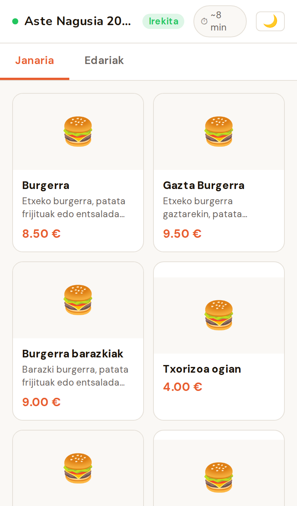

Bezeroak bere telefonoan sartzen du txosnaren URLa edo eskaneatzen du QR kodea. Pantailan ikusten du:

- **Kategoriak**: Janaria eta Edariak bereizita
- **Produktuen zerrenda**: Izena, prezioa, alergenoak, dieta-etiketak
- **Itxaron-denbora**: Zenbat minututan prest egongo den
- **Txosna egoera**: Irekita / Itxita / Pausatuta

##### 2. Produktua aukeratu

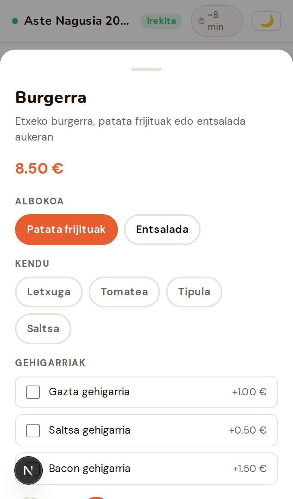

Produktu batean sakatu eta hautatzeko pantaila irekitzen da:

**Aldaerak aukeratu:**

- Tamaina (adib: Normal / Handia)
- Albokoak (adib: Patatak / Entsalada)

**Gehigarriak gehitu:**

- Gazta (+1€)
- Barazkiak (+0.50€)
- Baratxuria (+0.30€)

**Osagaiak kendu:**

- Letxuga
- Tipula
- Tomatea

**Kantitatea**: Zenbat unitate nahi diren

##### 3. Saskia ikusi

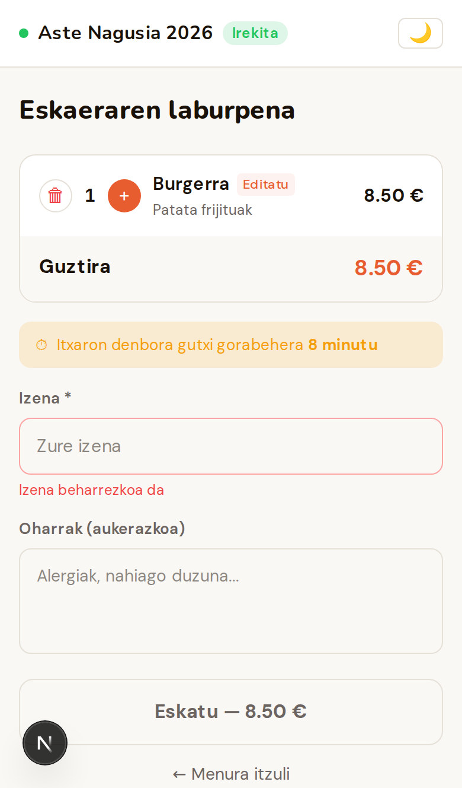

Saskian bildutako produktuak ikusteko, saskia ikonoa sakatu beheko barran:

- Produktuen zerrenda argazkiekin
- Aldaerak eta gehigarriak bakoitzeko
- Kantitatea aldatu edo ezabatu
- Guztizko zenbatekoa kalkulatuta
- "Jarraitu" botoia ordainketara joateko

##### 4. Eskaera baieztatu

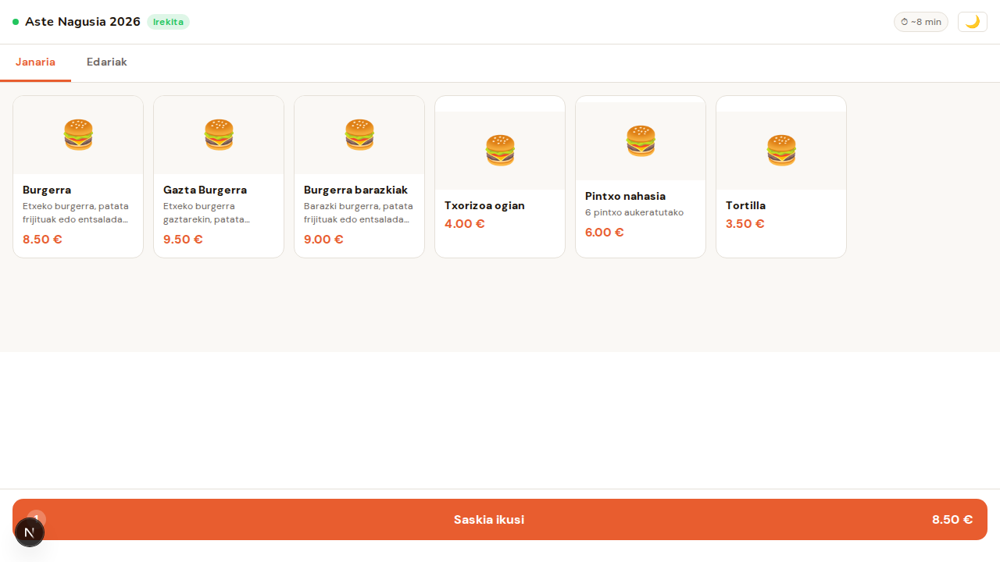

**4 pauso erraz:**

1. **Menua arakatu** - Janari eta edarien zerrenda
2. **Aukeratu** - Produktuari klik egin eta gehitu
3. **Saskia ikusi** - Edizioak eta gehigarriak
4. **Ordaindu** - Online edo mostradorean

**Ordainketa aukerak:**

- **Online (Stripe/Redsys)**: Txartelarekin ordaindu telefonoan
- **Mostradorean**: Esku-diruz edo txartelaz bertan ordaindu

- Saskia ikonoa behean
- Ordainketa segurua Stripe/Redsys

#### Eskaera Egoera

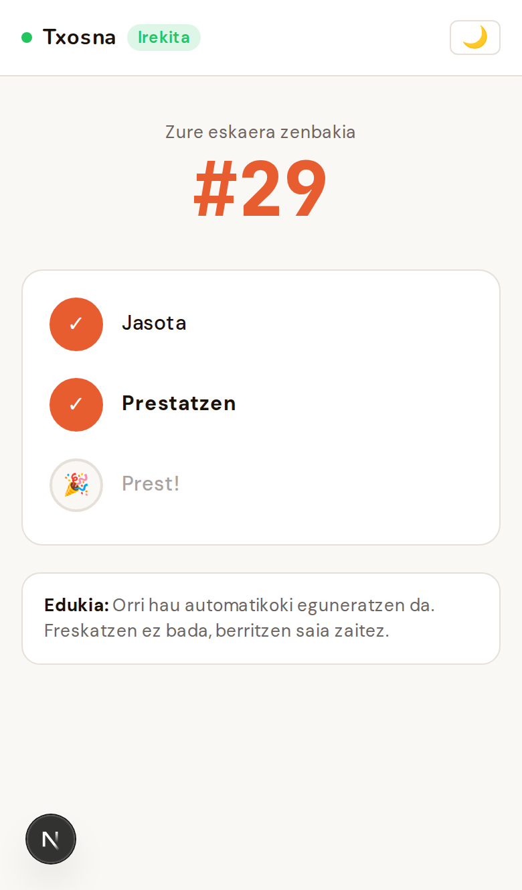

Bezeroak bere eskaeraren egoera ikusten du:

- ✅ Jasota (sukaldean)
- ⏳ Prestatzen
- 🔔 Prest (bildu)

**Push jakinarazpenak** eskuragarri prest denean.

#### Frogagirria (Pickup Proof)

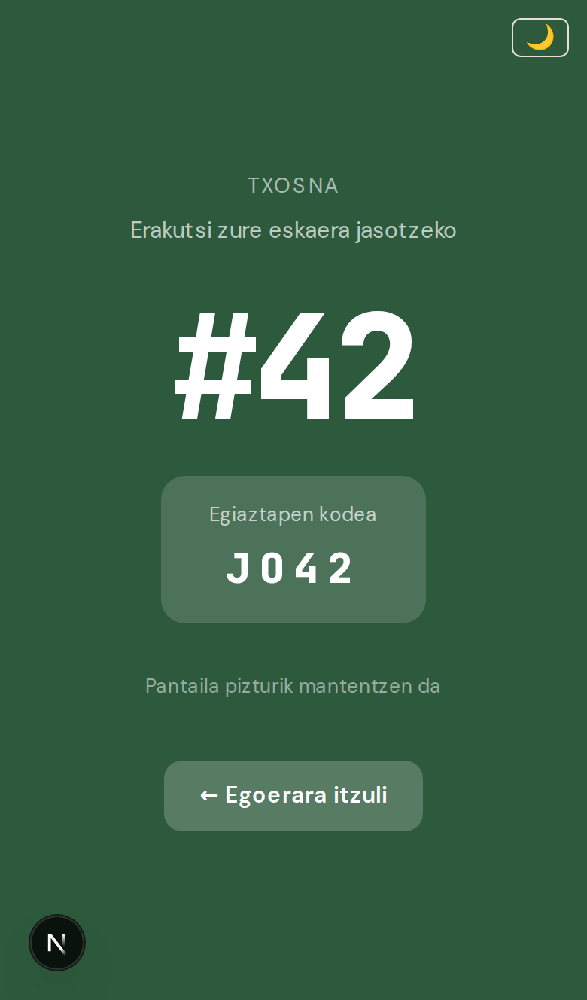

- Kontraste handiko pantaila
- Eskaera zenbakia handia
- QR kodea azkar frogatzeko
- Pantaila aktibo mantentzen da (WakeLock)

> **Oharra**: Bezeroak bere telefonoan frogagirria erakusten du, eta boluntarioak eskaera zenbakia edo QR kodea eskaneatzen du ordenatzeko.

#### Ordenatze Taula (Order Board)

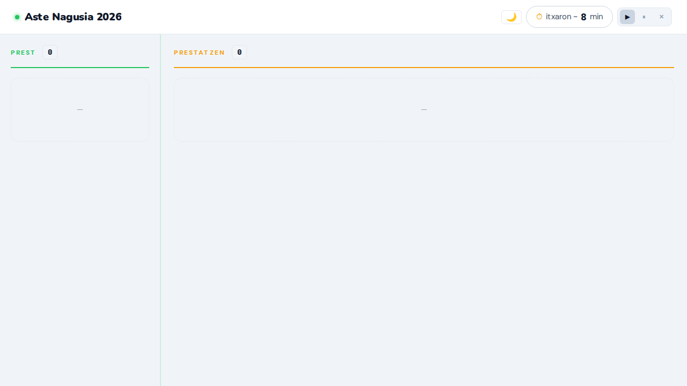

**Pantaila handietan erakusteko**:

- **Ezkerrean**: Prest dagoen eskaerak (berdea)
- **Eskuinean**: Prestatzen ari direnak (horia)
- Itxaron-denbora kalkulatua
- Automatikoki eguneratzen denbora errealean

---

### 2.2 Boluntarioen Pantailak

#### PIN Sarbidea

**URL:** `/eu/pin`

Boluntarioak sartzen diren lehenengo pantaila. PIN sinple bat erabiliz autentifikatzen dira eta dagokien pantailara bideratzen dira.

**Lau modu:**

| Modua         | Ikurra | Helmuga                                      |
| ------------- | ------ | -------------------------------------------- |
| **Janaria**   | 🍽     | Janari Mostradorea                           |
| **Edariak**   | 🍺     | Edari Mostradorea                            |
| **Sukaldea**  | 👨‍🍳     | KDS (post hautaketarekin edo zuzenean)       |
| **Kudeaketa** | 📋     | Sukalde Kudeaketa (koordinatzaile ikuspegia) |

**Sukaldeko post hautaketa:**

Txosnak sukaldeko postuak konfiguratuta baditu, **Sukaldea** modua aukeratzean eta PINa sartu ondoren, post-hautaketa pantaila agertzen da. Boluntarioak bere lan-postua hautatzen du (adib. "Parrilla" edo "Muntaia") eta KDS-ak post horretako tiketak bakarrik erakusten dizkio. "Kudeaketa (guztiak)" aukeratzean Sukalde Kudeaketa pantailara bideratzen da.

---

#### Sukaldea (KDS - Kitchen Display System)

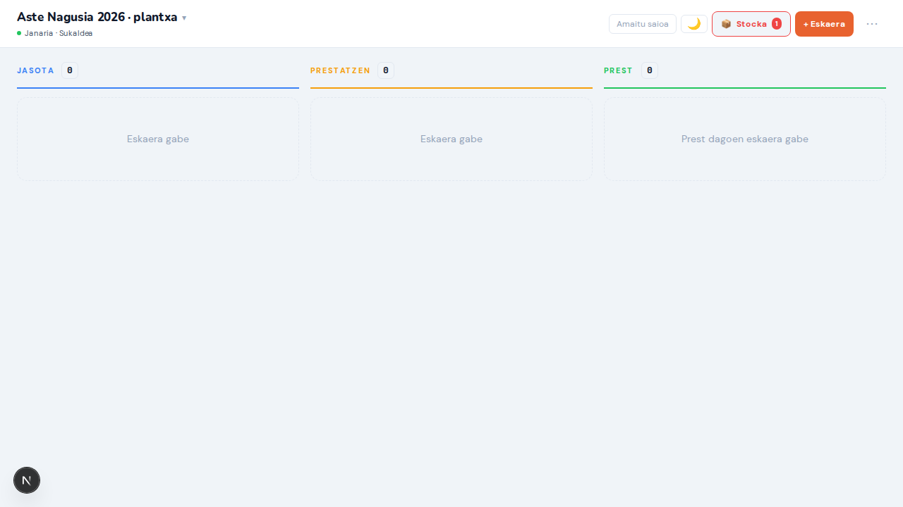

Sukaldeko langileentzako pantaila nagusia. Bertan ikusten dira denbora errealean sartzen diren eskaera guztiak eta haien egoera.

##### Goiburua (Header)

**Ezkerrean:**

- **Gertaera hautatzailea**: "Aste Nagusia 2026 ▾" - Txosnak aukeratzeko menua
- **Eremua eta mota**: "Janaria · Sukaldea · ⚠ 1 motel" - Zein txosna eta zein sukalde motatan ari den lanean; postuak badaude eta post bat hautatuta badago, post-izena erakusten du (adib. "Janaria · parrilla")

**Eskuinean - Kudeaketa botoiak:**
| Ikonoa | Izena | Funtzioa |
|--------|-------|----------|
| 🌙 | Modu iluna | Pantaila argitasuna doitzeko (gauak/egunak) |
| 📦 Stocka | Stock kudeaketa | Produktuak agortuta markatzeko dialogoa irekitzen du |
| ⋯ Aukerak | Aukerak | Sukaldea pausatu/ireki/itxi eta bestelako ezarpenak |

##### Hiru Zutabe Sistema

Eskaerak hiru zutabean antolatuta daude, Kanban estiloko taula batean:

| Zutabea        | Kolorea   | Azalpena                                        | Ekintza                                      |
| -------------- | --------- | ----------------------------------------------- | -------------------------------------------- |
| **Jasota**     | 🟡 Horia  | Eskaera berriak, oraindik ez da prestatzen hasi | "→ Hasi" botoia sakatu prestatzen hasteko    |
| **Prestatzen** | 🔵 Urdina | Sukaldean lanean ari diren eskaerak             | "→ Prest" botoia sakatu prest dagoenean      |
| **Prest**      | 🟢 Berdea | Bukatutako eskaerak, bildu daitezke             | "→ Amaituta" botoia sakatu entregatu ondoren |

##### Eskaera Txartelak (Ticketak)

**Goiko informazioa:**

- **⬆ Hurrengoa**: Hurrengo eskaera prestatzeko adierazlea
- **#38**: Eskaera zenbakia (bezeroak ikusten duena)
- **Miren**: Bezeroaren izena
- **Jasota/Prestatzen/Prest**: Eskaeraren uneko egoera
- **⏱ 14min**: Zenbat denbora daraman prestatzen

**Produktuen zerrenda:**

- **2× Txorizoa ogian**: Kantitatea × Produktu izena
- **— patata frijituak**: Aldaera aukeratua (adibidez: albokoak)
- **✕ Tipula**: Kentzeko osagaia (bezeroak kendu duena)
- **📝 Burgerra ondo eginda**: Prestaketa argibideak

**Beheko botoiak:**

- **📖**: Argibideen ikonoa - Klik egitean produktuaren prestaketa argibideak ikusten dira
- **→ Hasi / → Prest / → Amaituta**: Eskaera hurrengo egoerara pasatzeko

**Jakinarazpen bereziak:**

- **🔔 Eskaera aldatua**: Bezeroak eskaera aldatu du eta sukaldeak berriro ikusi behar du

##### Stock Kudeaketa

Sukaldeko langileek 📦 Stocka botoia erabiliz produktuak agortuta marka ditzakete. Hau erabilgarria da:

- Ingredienteen stocka amaitzen ari denean
- Sukaldeak ezin duen produktu bat egiteko
- Menua aldi baterako murrizteko

##### Sukaldearen Egoera Aldaketa

**Aukerak** (⋯) botoian sakatu eta:

- **Pausatu sukaldea**: Eskaera berriak jaso ez (adib: atsedenaldia)
- **Itxi sukaldea**: Sukaldea itxi (adib: txosna itxita)
- **Ireki sukaldea**: Sukaldea berriro martxan jarri

---

##### Stock Kudeaketa Dialogoa

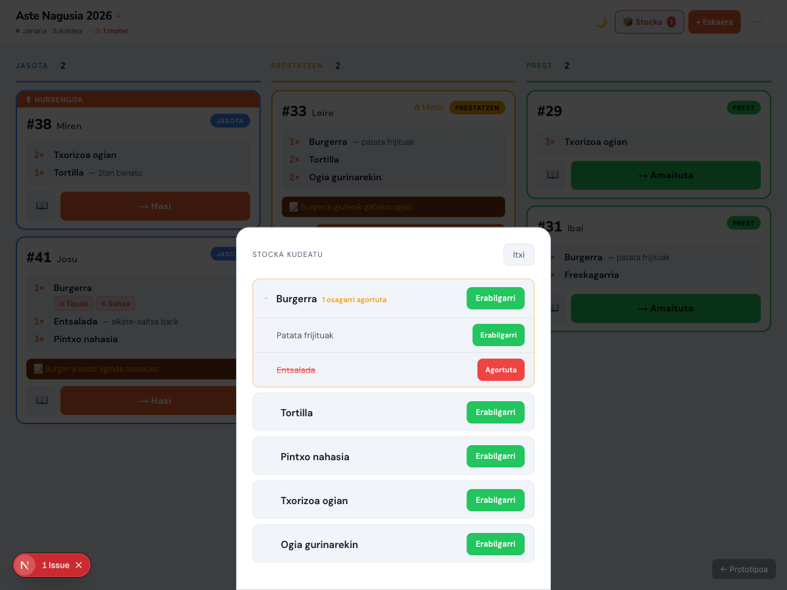

📦 Stocka botoia sakatzean, dialogo bat irekitzen da produktuak agortuta markatzeko:

**Produktuen zerrenda:**

- Produktu bakoitzaren izena eta egoera
- **Agortuta** / **Eskuragarri** toggle botoiak
- Bilaketa barra produktuak aurkitzeko
- Kategoriaka antolatuta (Janaria / Edariak)

**Agortze arrazoiak:**

- Ingredienteen eskasia
- Sukaldeko arazoak
- Eskaera gehiegia (denbora batez)

##### Prestaketa Argibideen Dialogoa

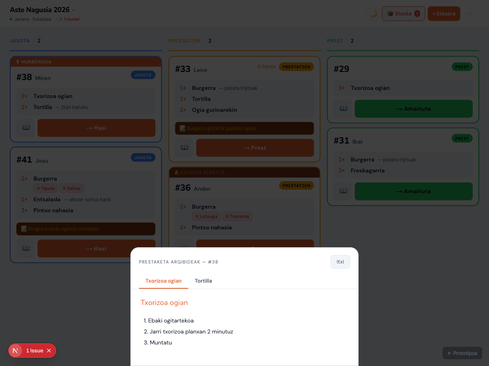

📖 ikonoa sakatzean, produktuaren prestaketa argibideak ikusteko dialogoa irekitzen da:

**Fitxak:**
| Fitxa | Edukia |
|-------|--------|
| **Argibideak** | Sukaldeko langileentzako jarraibide detallatuak |
| **Alergenoak** | Produktuaren alergenoen zerrenda |
| **Bestelakoak** | Dieta-etiketak, osagaien zerrenda |

**Markdown onarpena:**

- Testu lodia, etzana
- Zerrendak
- Koloreko testua

##### Sukaldea Pausatu/Itxi Dialogoak

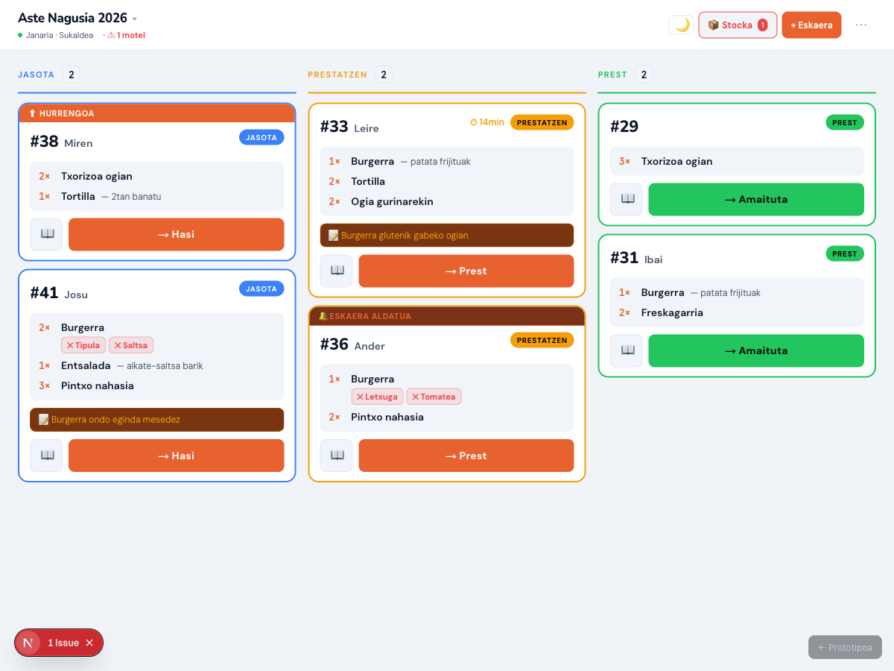

**Aukerak** (⋯) menuan sukaldearen egoera aldatzeko aukerak:

**1. Pausatu sukaldea:**

- Eskaera berriak automatikoki baztertzen ditu
- "Itzuli laster" mezua erakusten du bezeroei
- Sukaldean atsedenaldiak hartzeko erabilia
- Eskaera aktiboak prestatzen jarraitzen dira

**2. Itxi sukaldea:**

- Txosna guztiz itxita dagoela adierazten du
- "Itxita" mezua erakusten du bezeroei
- Eskaera berriak onartzen ez ditu
- Barne kudeaketa soilik

**3. Ireki sukaldea:**

- Sukaldea normaltasunera itzultzen du
- Eskaera berriak berriro onartzen ditu
- Denbora errealean eguneratzen da

---

#### Sukalde Kudeaketa (Kitchen Manager)

**URL:** `/eu/kitchen-manager`

Koordinatzailearen ikuspegi orokorra, sukaldeko post guztiak estaltzen dituena. Postuak dituzten txosnentzako diseinatuta dago.

**Goiburua:**

- Txosna-izena eta egoera-zenbatzaileak:
  - 🍳 **Sukaldean**: oraindik prest ez dauden eskaerak
  - ✅ **Jasotzeko**: post guztiak PREST dituzten eskaerak
- 📦 **Stock** botoia: produktuak agortzeko/aktibatzeko

**Eskaera Txartelak:**

Txartel bakoitzak ordena bat irudikatzen du:

| Elementua           | Deskribapena                                                   |
| ------------------- | -------------------------------------------------------------- |
| **#42 Miren**       | Ordena zenbakia eta bezeroaren izena                           |
| **Progresio-barra** | Post kopuruaren arabera PREST ehunekoa (anbarra → berdea)      |
| **Post errenkadak** | Post bakoitzeko egoera-etiketa (Jasota / Prestatzen / Prest ✓) |
| **Txartel berdea**  | Post guztiak PREST — bilketa-deia egiteko prest                |

**Ordenaketa:**

1. Prest dauden eskaerak lehenago (jasotzeko deia egin behar zaienak)
2. Zaharrenetik berrienera gainerakoak

**Onurak:**

- Koordinatzaileak ikustarazten du zein post gelditzen diren eskaera bakoitzeko
- Txartel berdeak argi adierazten du bezeroari deia egiteko unea
- Irakurtzeko bakarrik: egoera aldaketak sukaldekoek egiten dituzte beren KDS-tik
- Denbora errealean eguneratzen da SSE bidez — orria freskatu gabe

---

#### Mostradorea

**Janari Mostradorea:**

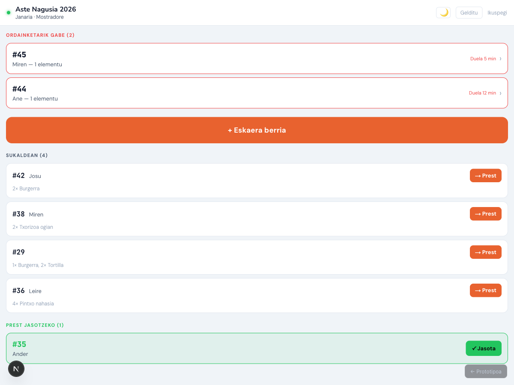

**Edari Mostradorea:**

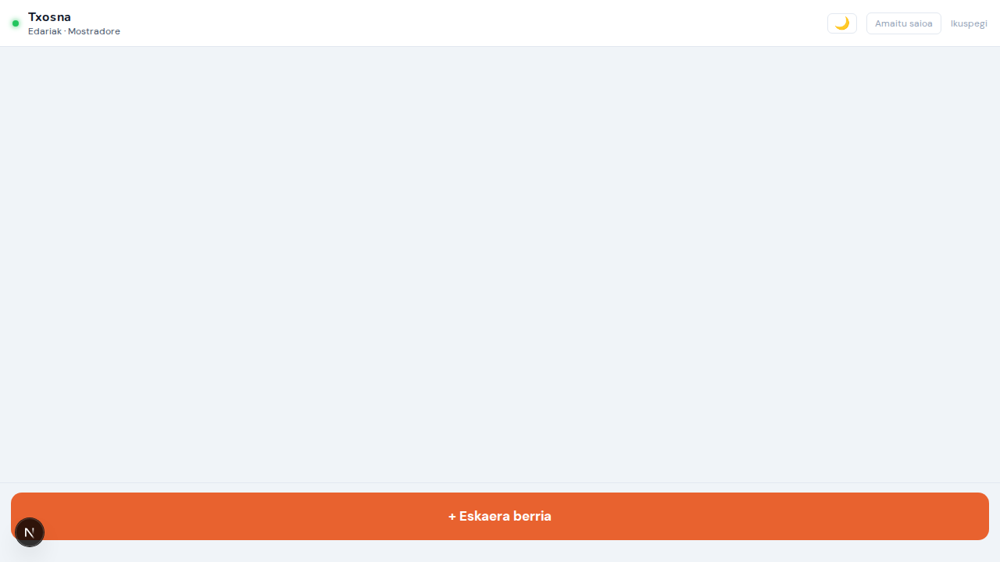

**Ordainketa-prozesua (ordainketa zain):**

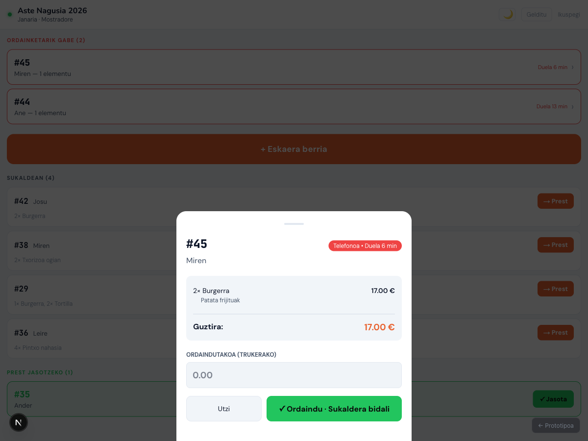

Mostradorean ordainketa zain dagoen eskaera bat kobratzeko:

1. **Hautatu eskaera** - "ORDAINKETARIK GABE" zerrendatik
2. **Sartu kopurua** - Ordaindutako diru-kopurua (trukerako kalkulatzeko)
3. **Egin klik** - "Ordaindu · Sukaldera bidali" botoian

**Eskaerak kudeatzeko:**

- Telefono-eskariak onartu
- Eskaerak editatu
- Prest dagoen eskaerak markatu
- Itxaron-denbora kalkulatua
- Zenbatzeko makina integratua

Boluntarioek mostradore edo sukalde bat hautatzen dute saioa hasteko.

---

### 2.3 Kudeaketa Panela (Admin)

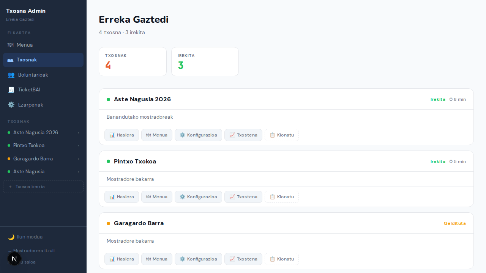

**Funtzio nagusiak:**

- Elkartearen txosna guztiak ikusi eta kudeatu
- Eskaera kopuruak eta diru-sarrerak denbora errealean
- Txosna bakoitzaren egoera: irekita, geldituta edo itxita
- Konfigurazio azkarra: menua, eskaerak, txostenak

#### Menu Kudeaketa

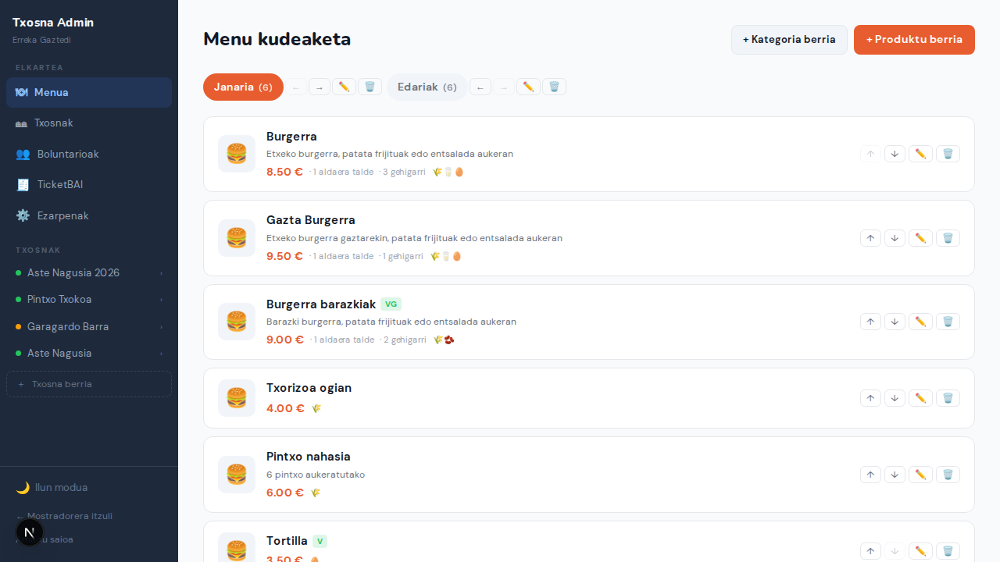

- **Kategoriak**: Janaria eta Edariak antolatu
- **Produktuak**: Izena, deskribapena, argazkia, alergenoak
- **Aukerak**: Tamaina, albokoak, osagai gehigarriak
- **Prezioak**: Txosna bakoitzeko prezio bereziak ezarri

**Produktu bat editatzea:**

Produktu bat editatzeko, editatu nahi den elementuaren ondoko ✏️ ikonoa sakatu. Editatzeko leihoak 4 fitxa ditu:

##### 1. Oinarrizkoa fitxa

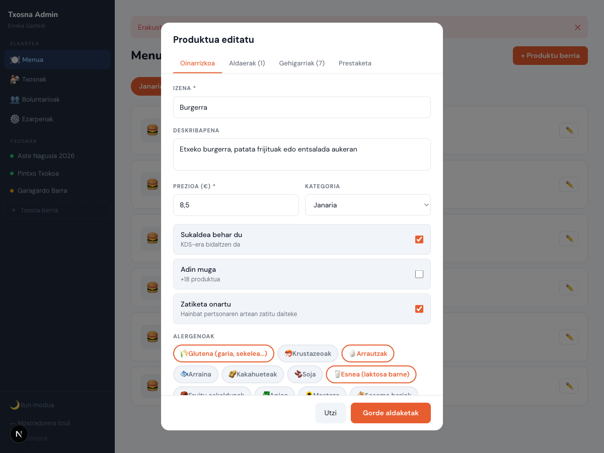

Fitxa honetan produktuaren oinarrizko datuak konfiguratzen dira:

| Eremua                | Deskribapena                         | Adibidea                         |
| --------------------- | ------------------------------------ | -------------------------------- |
| **Izena**             | Produktuaren izena                   | "Gazta Burgerra"                 |
| **Deskribapena**      | Bezeroarentzako azalpena             | "Etxeko burgerra gaztarekin..."  |
| **Prezio lehenetsia** | Oinarrizko prezioa                   | 9.50 €                           |
| **Kategoria**         | Janaria edo Edariak                  | Janaria                          |
| **Prestatu behar da** | Sukaldean prestatzen den ala ez      | ✓ Bai (burgerra) / ✗ Ez (edaria) |
| **Banatu daiteke**    | Hainbat pertsonatan banatu daitekeen | ✓ Bai (pintxo-sorta)             |
| **Adin-muga**         | +18 adina behar duen produktua       | ✓ Bai (alkoholdun edariak)       |
| **Osagaiak**          | Barruan dituen osagaien zerrenda     | Haragia, ogia, tomatea...        |

**Alergenoak** (14 europar alergeno):
🌾 Glutena · 🥛 Laktosa · 🥚 Arrautzak · 🥜 Kakahueteak · 🌰 Fruitu lehorrak · 🦐 Moluskuak · 🐟 Arrainak · 🐚 Zizka-mizka · 🍺 Sesamoa · 🌿 Zesamoa · 🍎 Sulfuroak · 🦆 Apioa · 🐑 Mostaza · 🍇 Lupinua

**Dieta-etiketak**:

- **V** - Begetariano (barazkiak + esnekiak/arrautzak)
- **VG** - Beganoa (barazkiak soilik)
- **GF** - Glutenik gabe
- **H** - Halal

##### 2. Aldaerak fitxa

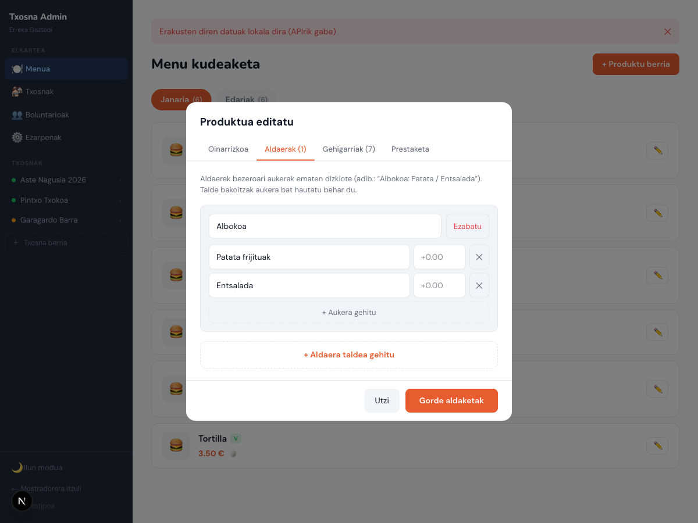

Produktuak tamaina edo aukera desberdinak baditu:

| Eremua             | Deskribapena                     | Adibidea                                       |
| ------------------ | -------------------------------- | ---------------------------------------------- |
| **Aldaera taldea** | Aldaera motaren izena            | "Albokoak"                                     |
| **Aukerak**        | Aukera bakoitza eta bere prezioa | "Patata frijituak" (+0€), "Entsalada" (+0.50€) |

Produktu batek hainbat aldaera talde izan ditzake (adib: "Tamaina" + "Albokoak").

##### 3. Gehigarriak fitxa

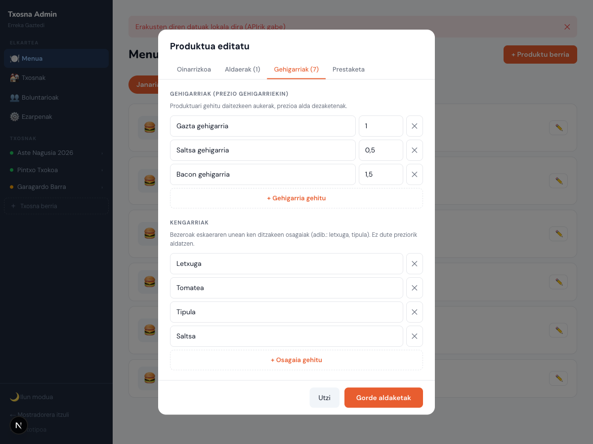

Bi motatako gehigarriak:

**Gehigarriak (prezio gehigarriekin):**

- Produktuari gehitu daitezkeen aukerak
- Prezioa alda dezakete
- Adibideak: Gazta (+1€), Barazkiak (+0.50€), Baratxuria (+0.30€)

**Kengarriak (preziorik gabe):**

- Bezeroak eskaeraren unean ken ditzakeen osagaiak
- Ez dute preziorik aldatzen
- Adibideak: Letxuga, Tipula, Tomatea

##### 4. Prestaketa fitxa

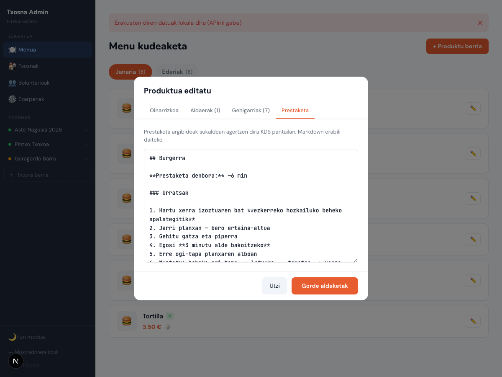

**Prestaketa argibideak:**

- Sukaldeko langileentzako jarraibideak
- KDS (Kitchen Display System) pantailan agertzen dira
- Markdown sintaxia onartzen du
- Adibideak: "Patatak bi aldiz frijitu", "Burgerra ondo egosi", "Entsalada azkenik gehitu"

#### Boluntarioen Kudeaketa

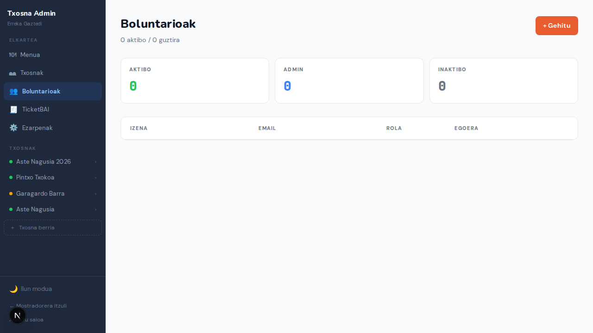

- Boluntarioen kontuak sortu eta kudeatu
- Rolak esleitu: ADMIN edo VOLUNTEER
- Pasahitzak berrezarri
- Jarduera ikusi

#### Txosna Konfigurazioa

Txosna bakoitzak konfigurazio propioa du, 4 fitxatan antolatuta:

##### 1. Orokorra fitxa

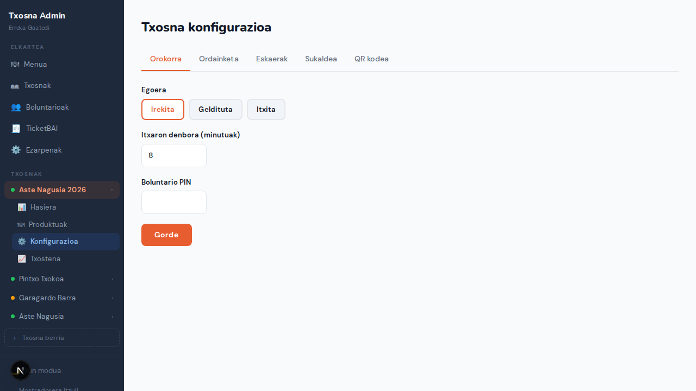

**Ezarpen orokorrak:**

- **Egoera**: Irekita / Geldituta / Itxita
- **Itxaron denbora**: Zenbat minututan prest egongo den eskaerak
- **Boluntario PIN**: Sukaldera sartzeko beharrezko PIN kodea
- **Sukaldeko postuak**: Lan-postu izendatuak sukaldean, koma banandurik (adib. "parrilla, muntaia, freidora"). Hutsik bada, sukaldea estazio bakarrekoa da eta KDS-ak tiketa guztiak erakusten ditu.

##### 2. Ordainketa fitxa

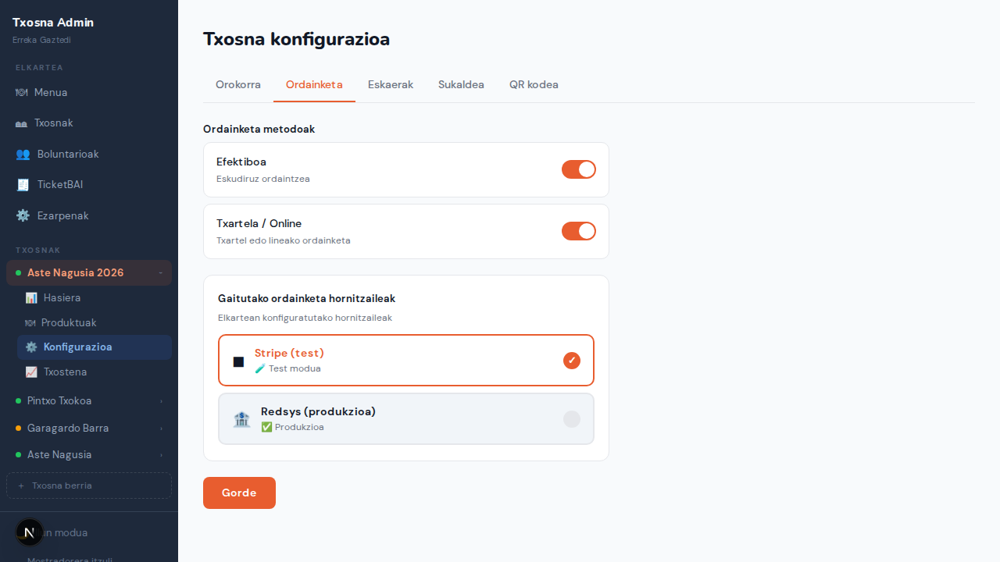

**Onartzen diren ordainketa metodoak:**

| Metodoa    | Deskribapena                                                      |
| ---------- | ----------------------------------------------------------------- |
| **CASH**   | Esku-dirua - Kudeaketa sinplea                                    |
| **STRIPE** | Txartelarekin online (Stripe) - Nazioartekoa, konfigurazio erraza |
| **REDSYS** | Txartelarekin online (Redsys) - Espainiarra, Bizum onartzen du    |

##### 3. Eskaerak fitxa

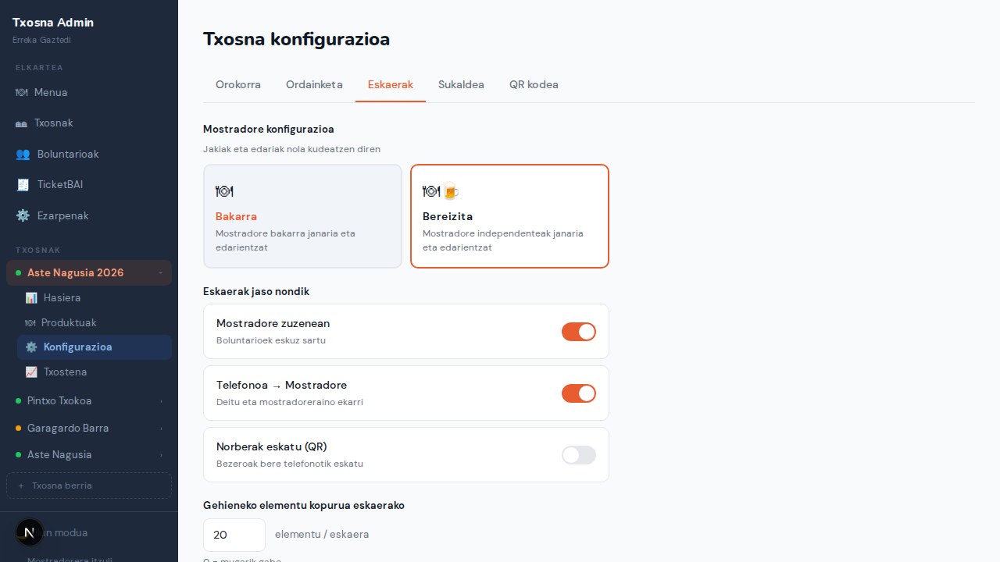

**Eskaera kanalak:**

| Kanala                                                | Deskribapena                                                                    |
| ----------------------------------------------------- | ------------------------------------------------------------------------------- |
| **Mostradorea (COUNTER)**                             | Bezeroa bertan eskatzen du eta ordaintzen du                                    |
| **Telefonoa + Online ordainketa (PHONE_ONLINE)**      | Bezeroak bere telefonoarekin eskatzen du eta Stripe/Redsys bidez ordaintzen du  |
| **Telefonoa + Mostradore ordainketa (PHONE_COUNTER)** | Bezeroak telefonoarekin eskatzen du baina mostradorean ordaintzen du esku-diruz |

> **Oharra**: Kanal bat baino gehiago gaitu daitezke aldi berean.

**Mostradore konfigurazioa:**

- **Bakarra (SINGLE)**: Janaria eta edariak mostradore berean jasotzen dira (txosna txikiak)
- **Banatua (SEPARATE)**: Janaria eta edariak bananduta jasotzen dira (txosna handiak)

**Beste ezarpenak:**

| Ezarpena                          | Azalpena                                                                 | Balio lehenetsia                |
| --------------------------------- | ------------------------------------------------------------------------ | ------------------------------- |
| **Ordainketa zain denbora-muga**  | Zenbat minututan bertan behera uzten den ordainketa osatu gabeko eskaera | 15 minutu (1-120 minutu artean) |
| **Sukaldeko txartelak inprimatu** | Eskaerak sukaldera bidaltzean txartelak automatikoki inprimatu           | Desgaituta                      |

##### 4. QR kodea fitxa

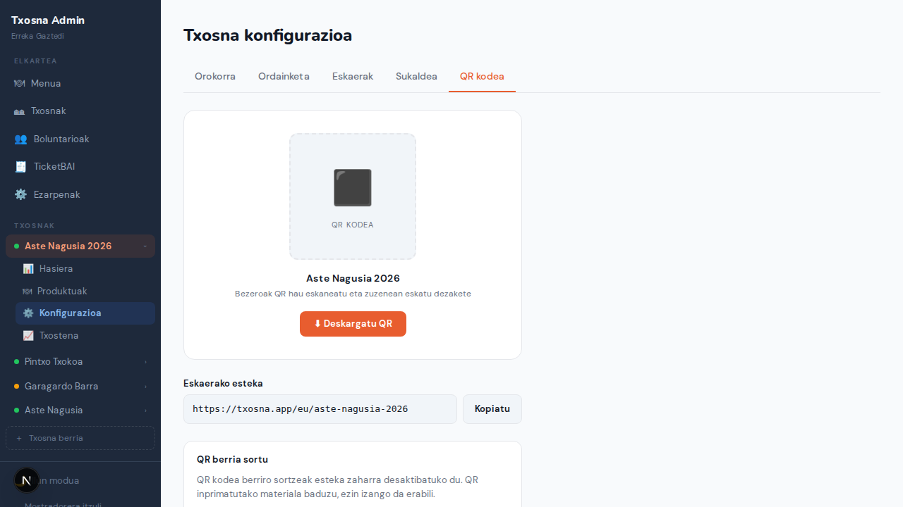

**Bezeroentzako eskaera esteka:**

Fitxa honek txosnara sartzeko esteka partekatzeko aukera ematen du. Bezeroek esteka hau erabil dezakete eskaerak egiteko:

- **QR kodea**: Bezeroek telefonoarekin eskaneatu dezaketen QR kodea
- **Esteka kopiatu**: URLa kopiatu eta partekatu (WhatsApp, sare sozialak, etab.)

Adibidez: `https://txosna.app/eu/aste-nagusia-2026`

> **Oharra**: Esteka hau txosna bakoitzarentzat bakarra da eta bezeroak zuzeneko eskaerak egiteko aukera ematen du.

##### Txosnako Produktuen Kudeaketa

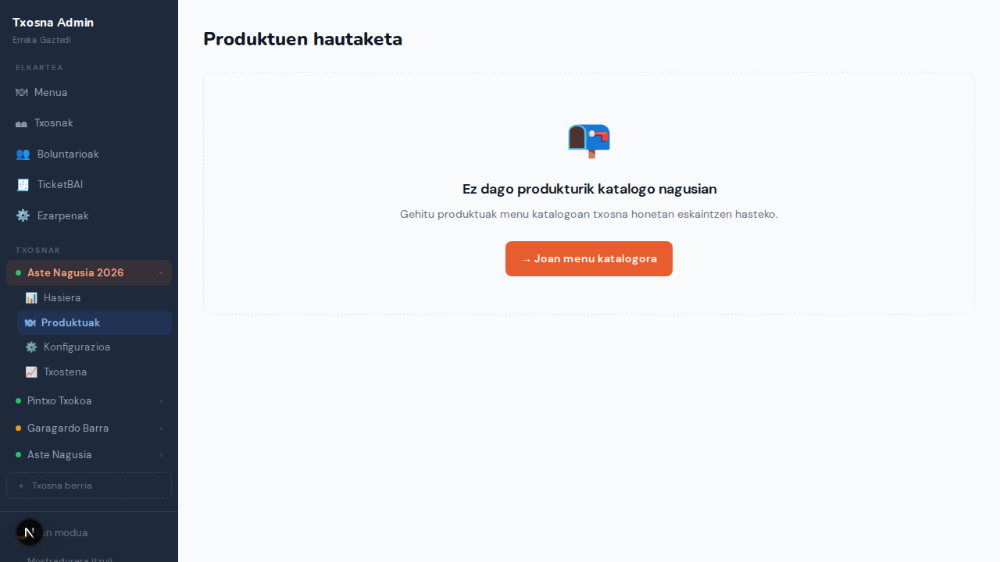

Txosna bakoitzean produktuen kudeaketa independentea dago. Orri honetan:

- **Produktuen zerrenda**: Txosnako produktu guztiak ikusi eta bilatu
- **Gaitu/Desgaitu**: Aukeratu zein produktu eskainiko diren txosna honetan
- **Stock egoera**: Produktu bakoitzaren eskuragarritasuna kontrolatu (agortuta / eskuragarri)
- **Prezioak**: Txosna bakoitzeko prezio bereziak ezarri

**Produktuak gaituta:**

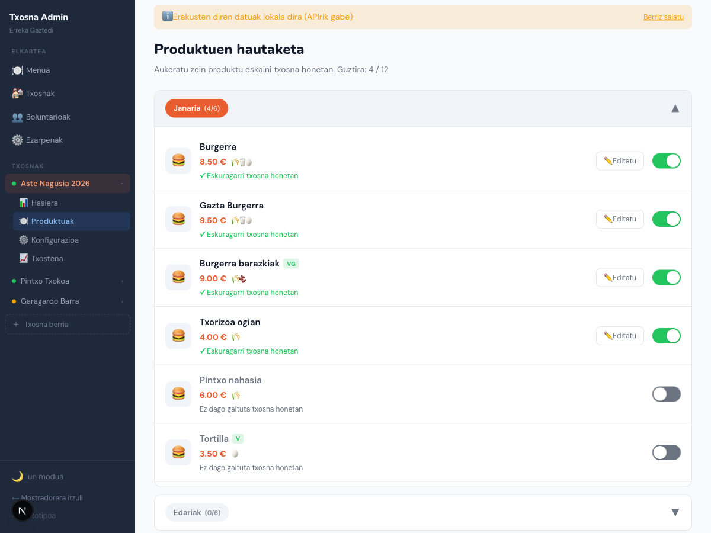

Produktuak gaitu eta konfiguratzeko, aktibatu etengailua eta egin klik "Editatu" botoian:

- ✅ **Gaituta** - Produktua txosna honetan eskaintzen da
- ⚙️ **Editatu** - Ireki ezarpenen dialogoa

**Produktuen ezarpenak txosnako:**

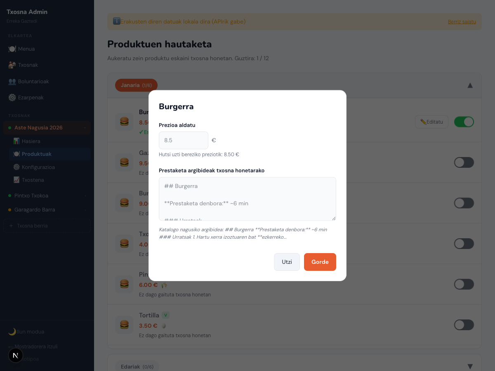

Produktu bat txosna batean gaitzean, hurrengo ezarpenak alda daitezke:

| Ezarpena             | Azalpena                                                            |
| -------------------- | ------------------------------------------------------------------- |
| **Gaituta**          | Produktua txosna honetan eskaintzen den ala ez                      |
| **Prezioa**          | Prezio orokorra gainidatzi (hutsik utzi balio orokorra erabiltzeko) |
| **Stock kantitatea** | Eska daitekeen kopuru maximoa (0 = mugarik gabe)                    |
| **Sukaldea**         | Produktu hau sukaldera bidaltzen den ala ez                         |
| **Itxaron denbora**  | Berezko prestaketa denbora (minututan)                              |

> **Oharra**: Produktu berri bat gehitzeko edo aldatzeko, orokorrean menu kudeaketa erabili (➡️ [Menu Kudeaketa](#menu-kudeaketa)).

#### Elkartearen Ordainketa Ezarpenak

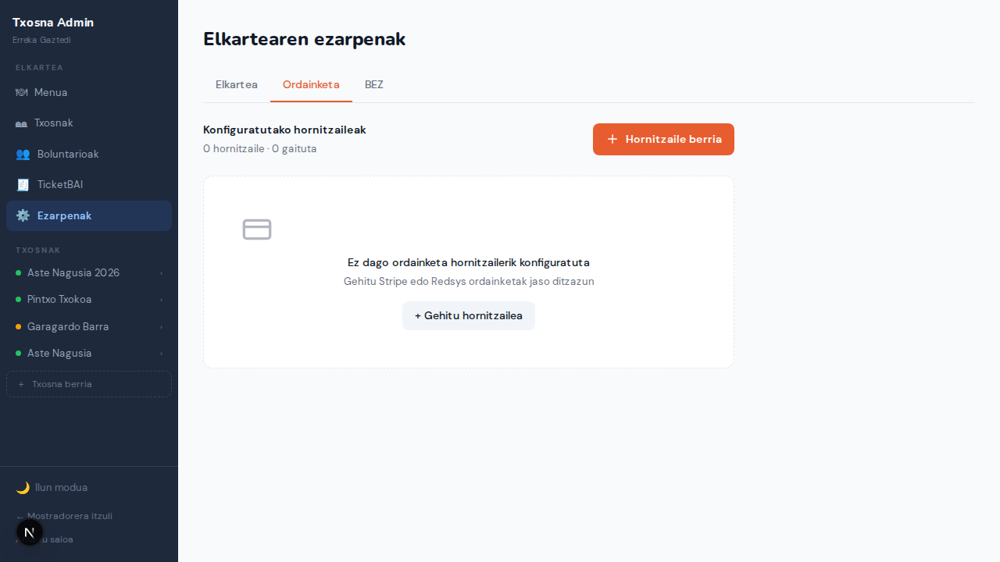

Elkarte mailan ordainketa metodo globalak konfiguratu daitezke. Orri honetan:

**Stripe konfigurazioa:**

- **Public Key**: Stripe kontuko pk*live*... gakoa
- **Secret Key**: Stripe kontuko sk*live*... gakoa
- Webhooks konfigurazioa automatikoa

**Redsys konfigurazioa:**

- **Merchant Code (FUC)**: Redsys merkataritza kodea
- **Terminal Number**: Terminal zenbakia
- **Commerce Secret (SHA256)**: SHA256 gakoa
- **Entorno**: Probak/Sandbox edo Produkzioa

> **Oharra**: Online ordainketak gaitzeko, gutxienez metodo bat (Stripe edo Redsys) konfiguratu behar da elkarte mailan, eta txosna bakoitzean gaitu.

#### Txostenak

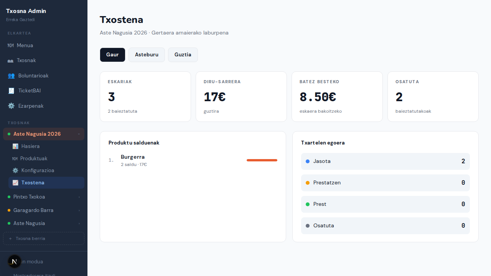

- Eskaera kopuruak denbora tartean
- Diru-sarrerak egun, aste edo hilabete kaibana
- Produktu arrakastatsuenak
- Bertan behera utzitako eskaerak eta arrazoiak

---

### 2.4 Sistema Oinarrizkoak

#### Saioa Hasi

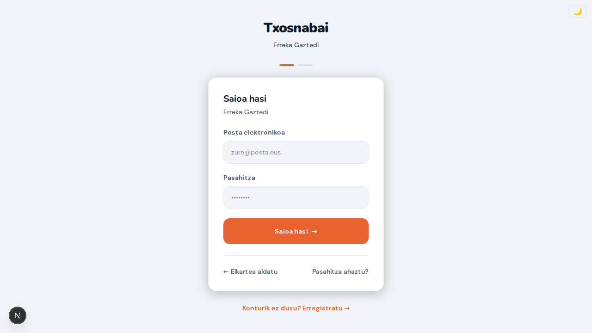

**2 pausoko prozesua:**

1. **Elkartea hautatu** — Elkartearen izena idatzi eta "Jarraitu" sakatu
2. **Kredentziakak sartu** — Posta elektronikoa eta pasahitza

- Pasahitza berrezarri aukera
- Segurtasun-tokenak

---

## 3. Eskaera Bizitza Zikloa

```
Bezeroa                 Sistema                    Sukaldea/Mostradorea
   |                       |                              |
   |  Eskaera egin         |                              |
   |---------------------->|                              |
   |                       |  Eskaera sortu               |
   |                       |  Tiketak sortu               |
   |  Eskaera baieztatua   |                              |
   |<----------------------|                              |
   |                       |----------------------------->|
   |                       |  Eskaera jaso                 |
   |                       |                              |
   |                       |                              |  Prestatzen
   |                       |<-----------------------------|
   |                       |  Prest                        |
   |  Jakinarazpena        |                              |
   |<----------------------|                              |
   |                       |                              |  Entregatu
   |                       |<-----------------------------|
   |                       |  Amaituta                     |
```

### Egoerak:

1. **ZAIN_ORDAINKETA** (telefono-eskariak bakarrik)
2. **BAIEZTATUA** → Tiketak sortzen dira
3. **JASOTA** → Sukaldean jasota
4. **PRESTATZEN** → Sukaldean lanean
5. **PREST** → Bildu dezakezu
6. **AMAITUTA** → Entregatuta

---

## 4. Konfigurazio Aukerak

### 4.1 Mostradore Mota

| Mota        | Deskribapena                         | Onura                        |
| ----------- | ------------------------------------ | ---------------------------- |
| **Bakarra** | Janari eta edariak mostradore berean | Txikia, talde txikientzako   |
| **Banatua** | Janaria eta edariak bananduta        | Azkarragoa, lan-fluxua hobea |

### 4.2 Eskaera Kanalak

- **Mostradorea**: Bezeroa bertan eskatzen du eta ordaintzen du
- **Telefonoa + Online ordainketa**: Bezeroak bere telefonoarekin eskatzen du eta bertan ordaintzen du (Stripe/Redsys)
- **Telefonoa + Mostradore ordainketa**: Bezeroak telefonoarekin eskatzen du baina mostradorean ordaintzen du esku-diruz

### 4.3 Ordainketa Metodoak

- **Esku-dirua**: Kudeaketa sinplea
- **Txartela**: Stripe edo Redsys integratua
  - Stripe: Nazioartekoa, konfigurazio erraza
  - Redsys: Espainiarra, Bizum onartzen du

---

## 5. Alergenoak eta Dieta Bereziak

Sistemak 14 alergeno europar identifikatzen ditu:

- Glutena, laktosa, arrautzak, fruitu lehorrak...
- Dietak: begetariano, begetariano, glutenik gabe, halal
- Bezeroak ikusten ditu eskaera egin aurretik
- Sukaldeak ikusten ditu preparazioan

---

## 6. Teknologiaren Laburpena

| Osagaia    | Teknologia               |
| ---------- | ------------------------ |
| Framework  | Next.js 16               |
| Hizkuntza  | TypeScript               |
| Datu-basea | PostgreSQL               |
| ORM        | Prisma                   |
| Estiloa    | Tailwind CSS             |
| UI         | Shadcn/ui + Radix        |
| Real-time  | SSE (Server-Sent Events) |
| Hosting    | VPS propioa              |

---

## 7. Hizkuntzak

Sistema lau hizkuntzetan eskuragarri:

- 🇪🇺 **Euskara** (lehenetsia)
- 🇪🇸 Gaztelania
- 🇫🇷 Frantsesa
- 🇬🇧 Ingelesa

---

## 8. Segurtasuna

- HTTPS zertifikatu guztietan
- Pasahitzak bcrypt hasheatuta
- Saioen kudeaketa segurua
- Multi-tenant: elkarte bakoitza bere datuekin

---

## 9. Hasiera Azkarra

### 9.1 Lehen aldiz konfiguratzeko:

1. Elkartea erregistratu
2. Lehen txosna sortu
3. Kategoriak eta produktuak gehitu
4. Boluntarioak gonbidatu
5. Ordainketa metodoa konfiguratu (nahi bada)
6. Txosna ireki!

### 9.2 Eguneko erabilera:

1. Boluntarioak saioa hasten du
2. Txosna ireki
3. Bezeroak eskaerak egiten ditu
4. Sukaldea prestatzen du
5. Mostradorea entregatzen du
6. Gaua amaitzean txostena jaitsi

---

## 10. Laguntza eta Kontaktua

Galderarik baduzu edo laguntza behar baduzu:

- Dokumentazioa: `/docs` karpetan
- Prototipoa probatu: `/prototype`
- Garatzailearekin kontaktatu

---

_Dokumentazio hau Txosna sistemaren 0.1.0 bertsioari dagokio._
_Azken eguneratzea: 2026ko apirila_
