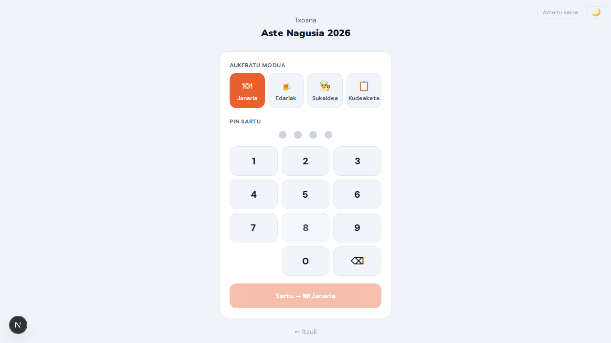
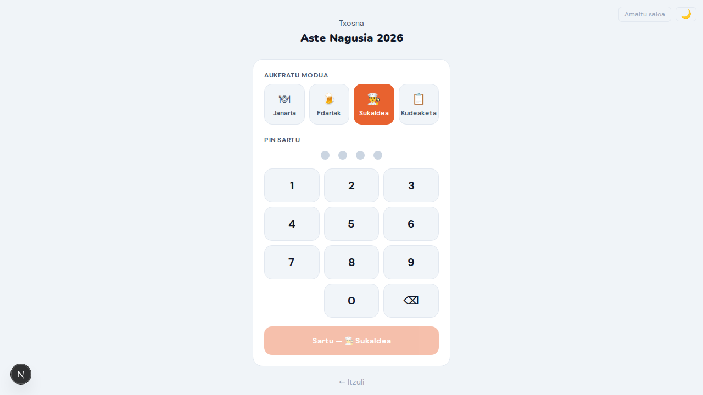
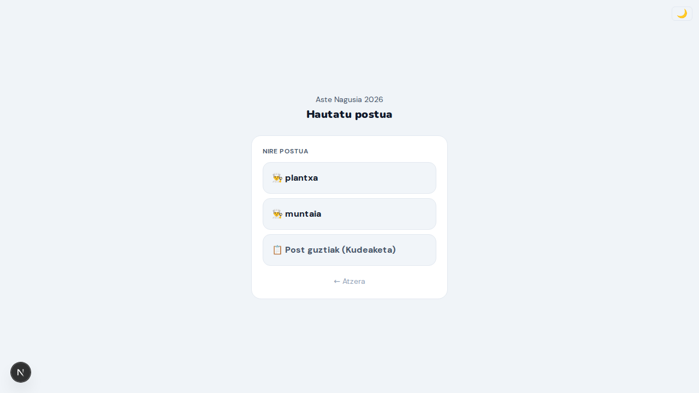
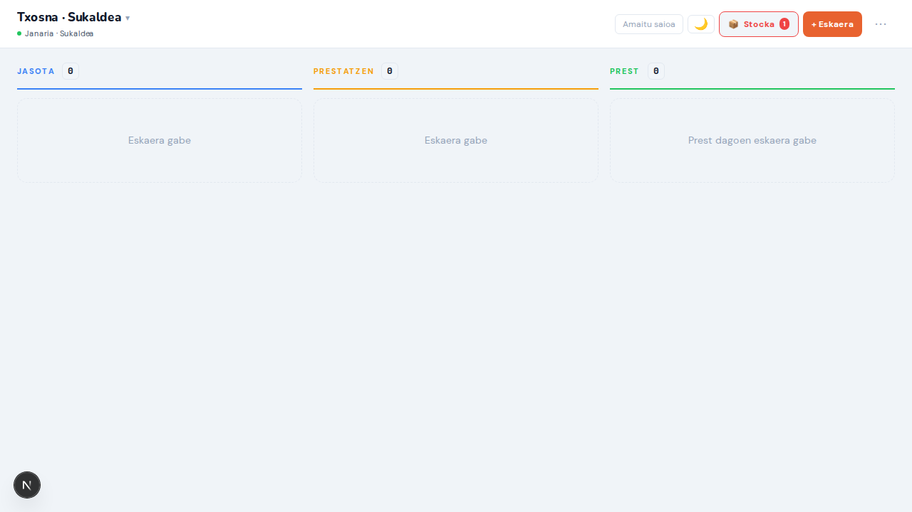
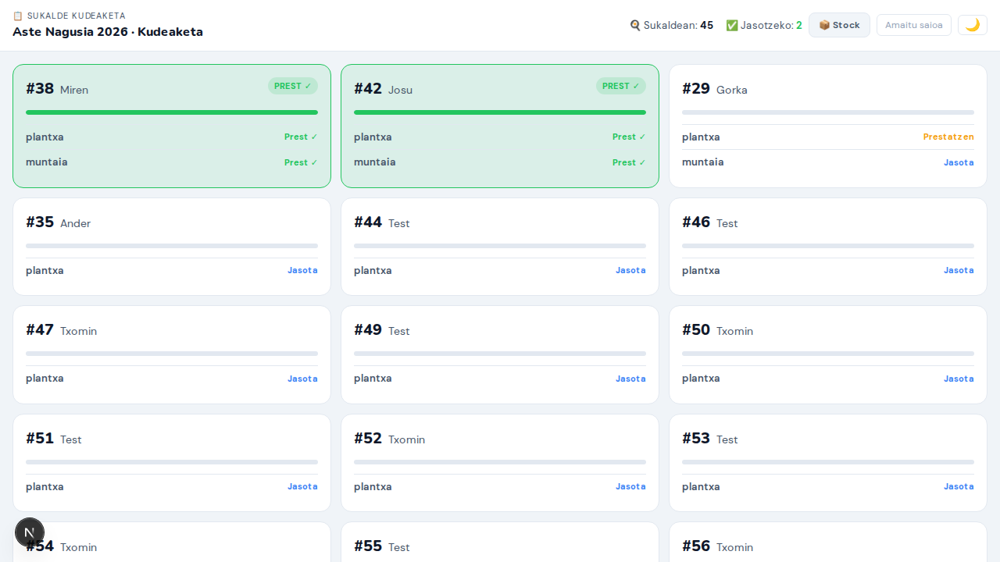
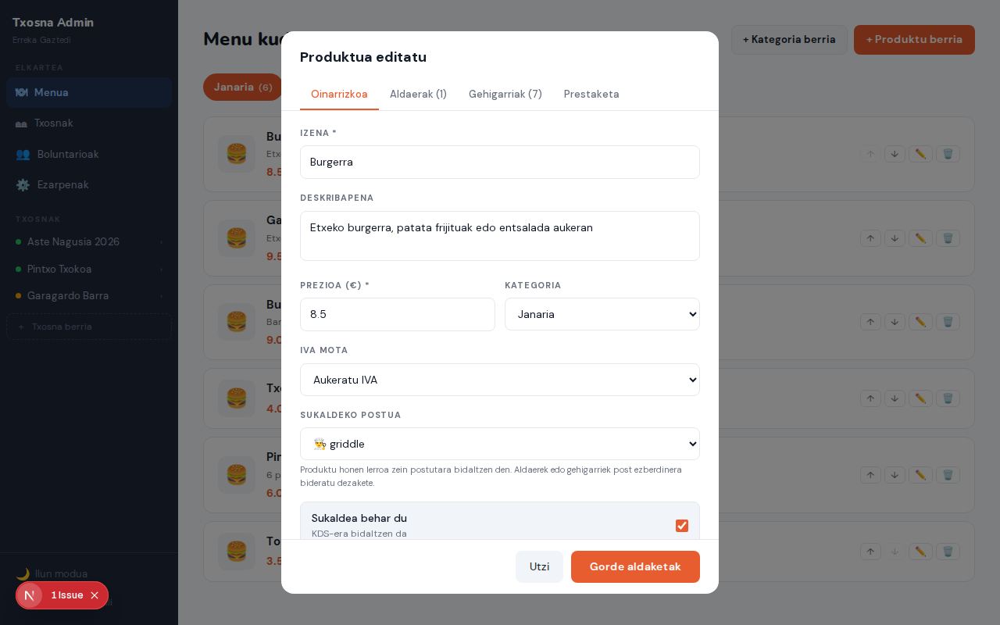
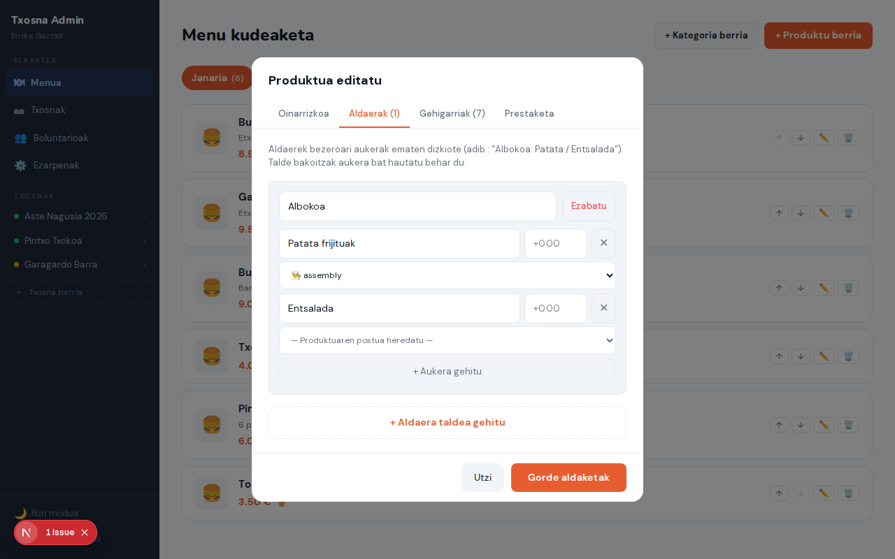
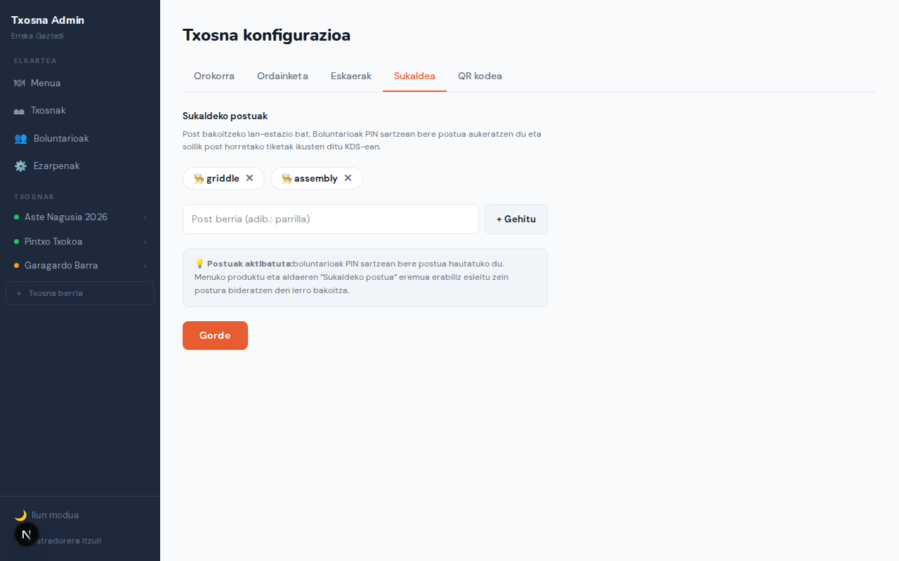

# Txosnabai — Prototipo Berrikuspena

### Interesdunentzako Dokumentua · 2026ko Apirila

---

> **Prototipo honek datu simulatuak erabiltzen ditu** — ez da backend errealik behar.
> Pantaila guztiak nabigatzen dira hemen: `http://localhost:3000/prototype`

---

## Zer da Txosnabai?

Txosnabai txosnak kudeatzeko sistema digital bat da: bezeroen autozerbitzu-eskaerak, sukaldeko lan-fluxua, mostradoreko kudeaketa eta administrazio-txostena biltzen dituen plataforma bakarra.

**Hiru erabiltzaile-mota:**

| Nor                   | Zer egiten du                                                            |
| --------------------- | ------------------------------------------------------------------------ |
| **Bezeroa**           | Menua ikusi, saskia osatu, eskaera bidali, egoera jarraitu               |
| **Boluntarioa**       | Mostradore edo sukaldean lan egin, eskaera kudeatu, ordainketak jasotzea |
| **Administratzailea** | Menua konfiguratu, boluntarioak kudeatu, txostenak ikusi                 |

---

## Pantailen ibilbidea

```
┌──────────────────────────────────────────────────────────┐
│                    BEZEROAREN IBILBIDEA                   │
│                                                           │
│  Menua ──► Produktua hautatu ──► Saskia ──► Checkout     │
│                                              │            │
│                                              ▼            │
│                                        Eskaera Egoera    │
│                                              │            │
│                                              ▼            │
│                                      Jasotzeko Frogagirria│
└──────────────────────────────────────────────────────────┘

┌──────────────────────────────────────────────────────────┐
│                  BOLUNTARIOAREN IBILBIDEA                 │
│                                                           │
│  PIN Sarbidea ──► Janaria Mostradore                      │
│               ├──► Edariak Mostradore                     │
│               ├──► Post hautaketa ──► Sukaldea (KDS)     │
│               └──► Sukalde Kudeaketa (koordinatzailea)   │
└──────────────────────────────────────────────────────────┘

┌──────────────────────────────────────────────────────────┐
│                 ADMINISTRATZAILEAREN IBILBIDEA            │
│                                                           │
│  Admin Panel ──► Menua / Boluntarioak / Ezarpenak        │
│              └──► Txostenak                               │
└──────────────────────────────────────────────────────────┘
```

---

# I. BEZEROAREN PANTAILAK

## 1. Menua

**URL:** `/eu/aste-nagusia-2026`

Bezeroaren lehen kontaktua txosnarekin. Pantaila honek txosna-izena, egoera (**Irekita** berde-argia), zain-denbora estimatua eta produktuen katalogoa erakusten ditu.

**Eginbideak:**

- Goiburuan: txosna-izena · egoera-etiketa · `~8 min` zain-denbora · gau-modu botoia
- Bi kategoria-fitxa: **Janaria** eta **Edariak**
- Produktu-txartelak: argazkia, izena, deskribapena eta prezioа (gorriz)
- Produktu bat ukituz gero, xehetasun-orria irekitzen da (aukera-taldeak, gehigarriak, osagaiak kentzeko aukera)

**Onurak kudeaketarako:**

- Bezeroak menua bere telefonoan ikusi dezake ilaran egon gabe
- Zain-denbora ikustean, bezeroak espektatibak kudeatzen ditu eta ez da etengabe galdetzen
- Produktuak agortzen direnean, KDS-etik "agortu" markatzen da eta bezeroaren menuan desaktibatu egiten da automatikoki

---

## 2. Eskaera Baieztapena (Checkout)

**URL:** `/eu/aste-nagusia-2026/checkout`

Saskiaren laburpena: elementuak berrikusi, izena eman eta eskaera bidali.

**Pantailak erakusten duena:**

- Saskia hutsik badago: "Saskia hutsik dago · ← Menura itzuli" mezu argia
- Saskia beterik: elementuen zerrenda prezio-unitarioekin, guztira eta izen-eremua
- "Eskaera bidali" botoia → eskaera sortzen da eta egoera-pantailara bidaltzen du

**Onurak:**

- Bezeroak bere eskaera berrikusteko aukera du aurretik — erroreak gutxitu
- Izenaren eremu soilak izaera pertsonala ematen dio: "Gorka" deitzea posible da

---

## 3. Eskaera Egoera

**URL:** `/eu/order/order-1`

Eskaerak bidali ondoren, bezeroak pantaila hau bistaratzen du. Egoera aldatzen doan heinean automatikoki eguneratzen da.

**Pantailak erakusten duena:**

- Eskaera-zenbakia handia eta nabarmena: **#42**
- Hiru pausoko progresoa:
  1. ✓ **Jasota** (betea, orangea)
  2. 🧑‍🍳 **Prestatzen** (itxaroten)
  3. 🎉 **Prest!** (itxaroten)
- Proto-oharra: "Egoera automatikoki aldatzen da (2s). Demo bakarrik."

**Onurak:**

- Bezeroak ez du galdetu behar "ea eskaera hartu duten" — pantailak erakusten du
- Zarata-maila mostradoreetan drastikoki murrizten da
- SSE (Server-Sent Events) bidez eguneratzen da denbora errealean — ez da orria freskatu behar

---

## 4. Jasotzeko Frogagirria

**URL:** `/eu/order/order-1/proof`

Eskaera prest dagoenean, bezeroak pantaila hau erakusten du mostradorera hurbildu baino lehen.

**Pantailak erakusten duena:**

- Atzeko planoa berde ilun osoan (distraktore gutxiago)
- Eskaera-zenbakia erraldoia: **#42**
- Egiaztapen-kodea tipografia monoespacioan: **GH-7421**
- "Pantaila pizturik mantentzen da" (WakeLock API)
- ← Egoerara itzuli botoia

**Onurak:**

- Boluntarioak zenbakia eta kodea ikusi besterik ez du egin behar: azkarra eta erroregabea
- Pantaila iltzatuta geratzen da (ez da itzaltzen bilketa-zain dagoen bitartean)
- Kodeak iruzurra saihesten du: edozeinek zenbakia ezagut dezake, baina kodea soilik eskaeraduna dauka

---

## 5. Jendaurreko Taula (Order Board)

**URL:** `/eu/aste-nagusia-2026/board`

Pantaila handietan (telebista, tablet) jartzeko moduko taula publikoa.

**Pantailak erakusten duena:**

- Ezkerraldea — **PREST (3)**: #30 GORKA ✓ · #34 JOSU ✓ · #38 ✓ (berde bizian)
- Eskuinaldea — **PRESTATZEN**: #29, #30, #33, #37 (anbarra) barne-irristaketa biziarekin
- Goiburuan: txosna-egoera + itxaron-denbora estimatua + erreprodukzio-kontrolak

**Onurak:**

- Bezeroak taulatik ikusi dezake bere zenbakia prest dagoen ala ez
- Txosna-arduradunak egoera ikustarazten du itxaronaldian dagoen jendeari
- Kodea sartu gabe funtzionatzen du — edozein pantailaetan jar daiteke

---

# II. BOLUNTARIOAREN PANTAILAK

## 6. PIN Sarbidea

**URL:** `/eu/pin`

Edozein boluntariok sartzen den lehen pantaila. Autentifikazio sinplea PIN zenbakiarekin.



**Pantailak erakusten duena:**

- Txosna-izena goiburuan: **Aste Nagusia 2026**
- Lau modu-botoi:
  - 🍽 **Janaria** (orangeaz nabarmenduta)
  - 🍺 **Edariak**
  - 👨‍🍳 **Sukaldea**
  - 📋 **Kudeaketa**
- 4 digituko PIN-teklatu
- Behean: "Sartu — [modua]" botoia

**Sukaldeko post hautaketa:**

Sukaldea modua hautatu eta PIN zuzena sartu ondoren, txosnak postuak konfiguratuta baditu, post-hautaketa pantaila agertzen da:



PIN onarpena eta gero:



- Post bakoitzeko botoi bat (adib. **griddle**, **assembly**) — boluntarioa bere postuko tiketak bakarrik ikusten ditu KDS-ean
- **Post guztiak (Kudeaketa)** — koordinatzaileak ikuspegi orokorra ikusten du

**Sukaldeko post hautaketa:**

PIN onartzen denean eta **Sukaldea** modua hautatuta dagoenean, txosnak postuak konfiguratuta baditu (adib. "Parrilla" eta "Muntaia"), post-hautaketa pantaila agertzen da:

- Post bakoitzeko botoi bat — boluntarioa bere lan-postuan jartzen da eta post horretako tiketak bakarrik ikusten ditu KDS-ean
- **Kudeaketa (guztiak)** aukera — koordinatzaileak post guztien ikuspegi orokorra ikusten du

**Onurak:**

- Boluntarioak ez du pasahitz konpliaturik gogoratu behar
- Modu-hautaketak boluntarioa zuzenean dagokion pantailara bidaltzen du
- PIN bakarra txosna guztiarentzat: erraztasun operatiboa
- Post hautaketak sukaldeko lan-fluxua banatzen du: parrillako boluntarioak bere tiketak bakarrik ikusten ditu, nahastasunik gabe

---

## 7. Janaria Mostradore

**URL:** `/eu/counter`

Janari-mostradoreko kudeaketa-pantaila nagusia.

**Pantailak erakusten duena:**

- Goiburua: **Aste Nagusia 2026 · Janaria · Mostradore** + Gelditu / Ikuspegi botoiak
- **ORDAINKETARIK GABE (2)** atalа (gorria): #45 Miren (duela 5 min) · #44 Ane (duela 12 min) — ordainketa zain
- **+ Eskaera berria** botoi nagusi orangea
- **SUKALDEAN (4)** atala: #42 Josu, #38 Miren, #29, #36 Leire — bakoitzak `→ Prest` botoia

**Onurak:**

- Ordainketarik gabeko eskaera guztiak ikusten dira goialdean, denbora-marka barne
- Boluntarioak presaka dauden kasuak identifikatu ditzake berehala (duela 12 min)
- `→ Prest` botoiak eskaera prest markatzen du eta bezeroaren telefonora jakinarazpena bidaltzen da

---

## 8. Edariak Mostradore

**URL:** `/eu/drinks`

Edariak mostradorearen pantaila: zerrendako eskaerak eta eskaera berrien sortzailea.

**Pantailak erakusten duena:**

- Goiburua: **Edariak · Mostradore**
- **ZAIN (2)** atala:
  - #41 Josu (duela 4 min) — 2× Garagardoa + 1× Ura = **6.00 €** · `✓ Entregatu` (berdea)
  - #38 (duela 9 min) — 3× Ardoa = **9.00 €** · `✓ Entregatu`
- **+ Eskaera berria** botoi handia behean

**Onurak:**

- Edariak mostradoreak bere ilara propioa du, janariaren ilararengandik independentea
- `✓ Entregatu` botoiak eskaera zuzenean ixten du — sukaldera joan gabe
- Prezio totala modu nabarmenean bistaratzen da: ordainketa azkarragoa

---

## 9. Sukaldea — KDS (Kitchen Display System)

**URL:** `/eu/kitchen`

Sukaldeko pantaila nagusia. Hiru zutabe dauzka egoeraren arabera. Txosnak sukaldeko postuak konfiguratuta baditu eta boluntarioak post bat hautatu badu PIN sarbidean, KDS-ak post horretako tiketak bakarrik erakusten ditu — goiburuan ageri da zein postutan dagoen (adib. **Aste Nagusia 2026 · parrilla**).

**Post bidezko iragazkia:**

Txosnak sukaldeko postuak konfiguratuta dituenean (adib. _griddle_, _assembly_), KDS-ak boluntario bakoitzak PIN sarreran hautatutako postuaren tiketak bakarrik erakusten ditu. Goiburuak beti erakusten du zein postutan zauden:



**Pantailak erakusten duena:**

- Goiburua: **Aste Nagusia 2026 · griddle** + gau-modua + 📦 notifikazio-txipa + **+ Eskaera** botoia
- Hiru fitxa: **2 Jasota** · **2 Prestatzen** · **2 Prest**
- Lehen txartela — #38 Miren:
  - `JASOTA` etiketa urdina
  - 2× Txorizoa ogian · 1× Tortilla — _2tan banatu_
  - `→ Hasi` botoi orangea + liburua ikurra (prestatze-argibideak)
- Bigarren txartela — #41 Josu:
  - 2× Burgerra — ❌ Tipula · ❌ Saltsa (osagaiak kentzeko aginduak argi ikusten dira)
  - 1× Entsalada — _alkate-saltsa barik_
  - 3× Pintxo nahasia
  - 📝 "Burgerra ondo eginda mesedez" oharra (anbarra atzeko planoaz)
  - `→ Hasi` botoia

**Onurak:**

- Sukaldeko boluntarioak begirada bakarrean ikusten du zer prestatu behar duen _bere postu espezifikoan_
- Osagaiak kentzeko aginduak modu ikusgarrian bistaratzen dira (❌ ikurra): errore gutxiago
- Bezeroen oharrak anbarra kolorez markatzen dira: ezin da galdu
- `→ Hasi` ukitze bakarrarekin eskaera "Prestatzen" kolumnara mugitzen da eta bezeroari jakinarazten zaio
- Post-iragazkiak nahasmena ekiditen du: parrillakoek bere tiketak bakarrik ikusten dituzte

---

## 10. Sukalde Kudeaketa (Kitchen Manager)

**URL:** `/eu/kitchen-manager`

Koordinatzailearen pantaila: sukaldeko eskaera guztiak ikuspegi bakarrean, post guztietakoak barne. PIN sarreran **Post guztiak (Kudeaketa)** hautatuz edo **📋 Kudeaketa** modu zuzena erabiliz iristen da.



**Pantailak erakusten duena:**

- Goiburua: **Aste Nagusia 2026 · Kudeaketa** + estatistika-txipak:
  - 🍳 **Sukaldean:** eskaera kopurua prestatzen
  - ✅ **Jasotzeko:** prest dauden eskaera kopurua
  - 📦 **Stock** botoia (stock-kudeaketa panel bat irekitzen du)
- Eskaera-txartelak ordena honetan: prest daudenak lehenik (bilketa eskaeraren zain), gero zaharrenak aurrera
- Txartel bakoitzak erakusten du:
  - **Eskaera-zenbakia** eta bezero-izena
  - **Progres-barra**: post-tiketen zein ehuneko dauden prest
  - **Post-errenkadak**: post bakoitzeko (adib. _griddle_, _assembly_) egoera bereizi bat — _Jasota_, _Prestatzen_, _Prest ✓_
  - Eskaera guztiz prest dagoenean, txartela berdez nabarmenduta agertzen da: **PREST ✓**
- Denbora errealean eguneratzen da SSE bidez

**Onurak:**

- Koordinatzaileak une bakoitzean eskaera bakoitzaren egoera guztia ikusten du — bi postutan banatuta dagoen eskaera ere bai
- "Prest" txartelak goialdean agertzen dira: bilketa-deiak azkarrago egiten dira
- Post-iragazkirik gabe: ikuspegi osoa, ez bakarrik postu batekoa
- Stock-botoia eskura: produktua agortzen denean berehala desgaitu daiteke boluntarioen menutatik
- Irakurtzeko bakarrik: sukaldekoek egoera aldatzen dute beren KDS-tik

---

## 11. Egoera Ikuspegi (Overview)

**URL:** `/eu/overview`

Txosna osoaren egoera-laburpena denbora errealean. Zuzendariarentzat edo boluntario nagusiarentzat.

**Pantailak erakusten duena:**

- **ORAIN BERTAN** lau txipa:
  - ITXAROTEN · **1** eskaera
  - PRESTATZEN · **3** eskaera
  - PREST · **1** jasotzeko
  - MOTEL · **1** eskaera (gorria — atentzioa behar)
- **TXOSNA EGOERA** blokea:
  - Egoera: **IREKITA**
  - Itxaron denbora: **~8 min**
  - Boluntarioak aktibo: **3 / 4**
- **MOSTRADOREAK** zerrenda: Janari Mostradore → · Edari Mostradore → · Sukaldea (KDS) →

**Onurak:**

- Txosna-arduradunak segundotan ikusten du egoera orokorra
- "Motel" zenbagailuak isil-isileko arazo bat agerian uzten du (eskaera geldituta)
- Boluntarioak aktibo / guztira: hutsuneak antzemateko eta laguntza eskatzeko

---

# III. ADMINISTRATZAILEAREN PANTAILAK

## 12. Admin Panel — Nabigazio-alboko barra

Pantaila guztietan agertzen da ezkerrean (mahai gainekoan) edo menu gisa (mugikorrean).

**Erakusten duena:**

- **Txosna Admin** goiburua · Elkartea izena
- ELKARTEA atala: Menua · Txosnak · Boluntarioak · Ezarpenak
- TXOSNAK atala: Aste Nagusia 2026 (berdea) · Pintxo Txokoa (berdea) · Garagardo Barra (anbarra)
- \+ Txosna berria botoia
- Behean: Ilun modua · ← Mostradorera itzuli

**Onurak:**

- Elkarte batek hainbat txosna kudeatu ditzake interfaze bakarretik
- Txosna-kolorea (berdea/anbarra/gorria) egoera azkar irakurtzeko

---

## 13. Menu Kudeaketa

**URL:** `/eu/menu`

Produktu-katalogoa sortu, editatu eta antolatzeko pantaila.

**Pantailak erakusten duena:**

- Kategoria-botoiak: **Janaria (6)** (orangeaz) · **Edariak (6)**
- Produktu-txartelak: irudia, izena, prezioa, aukera-taldeen kopurua, gehigarrien kopurua eta alergenoen ikonoak
- Produktu bakoitzak ✏️ editatu botoia

**Produktu-editoreak barne hartzen ditu:**

- Oinarrizko datuak (izena, prezioa, deskribapena, argazkia)
- **Sukaldeko postua** (txosnak postuak konfiguratuta baditu): produktua postu jakin bati esleitzeko hautatzailea
- Aukera-taldeak (adib. Patata frijituak / Entsalada) — aukera bakoitzak ere badu bere sukaldeko postua
- Gehigarriak (prezio gehigarriarekin) — gehigarri bakoitzak ere badu bere sukaldeko postua
- Osagaiak kentzeko aukera (prezio-aldaketarik gabe)
- 14 EU alergenoak (ikur eta etiketarekin)
- Dietako banderak: V · VG · GF · HL
- Prestatze-argibideak (markdown formatuan)
- Zatitu arauak (gehienez N zatitan)

**Produktuaren sukaldeko postua ezartzea:**



Txosnak sukaldeko postuak konfiguratuta dituenean, produktu-editorean "Sukaldeko postua" hautatzaile bat agertzen da. Produktu bat postu jakin bati esleitzen zaionean, produktu horren tiketak beti postu horretara joaten dira.

**Aukera-taldeen per-aukera sukaldeko postua:**



Aukera-taldeko aukera bakoitzak bere sukaldeko postua dauka. Honek aukera ematen du produktu bat orokorrean postu bati esleitzea, baina aukera berezi bat beste postu batera bidaltzea (adib. _griddle_ postuko burgerra baina _fryer_ postu batera bidaltzeko "patata frijituak" aukera).

**Post-esleipen logika:**

Eskaera bat sortzen denean, sistemak janari-lerro bakoitzeko sukaldeko postuak biltzen ditu:

- Produktuaren postua
- Hautatutako aukeraren postua
- Hautatutako gehigarrien postuak

Lerro batek post bat baino gehiago ukitzen badu, lerroaren kopia bat bidaltzen da post bakoitzeko tiketan. Posturik gabeko lerroak tiketa orokor baten bidaltzen dira.

**Onurak:**

- Menua aldatzen duten aldioro boluntarioak ez du paperik eguneratu behar
- Alergenoen informazioa beti eguneratuta eta ikusteko errazean
- Prestatze-argibideak KDS-ean agertzen dira: sukaldekoak beti jakin dezake nola egin
- Post per-aukera ezartzeak zehazki kontrolatzen du zein postura joaten den eskaeraren zein zati

---

## 14. Boluntarioak

**URL:** `/eu/volunteers`

Boluntario-erregistroa eta rolen kudeaketa.

**Pantailak erakusten duena:**

- Goiburua: **Boluntarioak · Aste Nagusia 2026 · 3 aktibo / 4 guztira**
- AKTIBO: **3** (berdez) · beste bat inaktibo (urdinez)
- Zerrenda: Amaia Etxeberria · Gorka Zubia · Itziar Larrea · Beñat Aranburu
- Bakoitzak email zutabea eta rol/egoera zutabea

**Onurak:**

- Txosna-arduradunak une bakoitzean nor dagoen aktibo ikusten du
- Rolen kudeaketa: ADMIN rolak konfigurazio-pantailetarako sarbidea du; VOLUNTEER rolak ez
- Boluntario berriak gehitzea: formulario sinple bat email + izenekin

---

## 15. Txosna Konfigurazioa

**URL:** `/eu/txosna`

Txosna bakoitzaren parametroak ezartzeko pantaila. Bost fitxa ditu.

**Orokorra fitxa:**

- Egoera hautatzailea: **Irekita** · Geldituta · Itxita
- Itxaron denbora (minutuak): **8**
- Boluntario PIN: **1 2 3 4**
- Gorde botoia

**Sukaldea fitxa (berria):**



- Sukaldeko postuak txip-zerrendan: adib. **griddle** · **assembly** (bakoitza ✕ botoiarekin ezaba daiteke)
- "Postu berria" testu-eremua eta **Gehitu** botoia
- Oharra: "Postuak hutsik → tiketa bakar bat; postuak gehituta → boluntarioak bere postua hautatzen du PIN sarreran"
- **Gorde** botoia

Postuak hutsik utziz gero, sukaldea estazio bakarrekoa da (tiketa bakarra eskaera guztientzat). Postuak gehituz gero, PIN sarreran post-hautaketa pantaila agertzen da boluntarioei eta eskaeren janari-lerroak postu egokiei bideratzen zaizkie automatikoki.

**Gainerako fitxak:**

- **Ordainketa**: eskudirua (beti) · txartela (toggle) + hornitzailea (Stripe / Redsys)
- **Eskariak**: mostradore mota (BATERATU / BEREIZITA), kanalak, elementu-muga, inprimagailua (ESC/POS edo STAR)
- **QR**: kode sortzailea jendaurreko taularentzat

**Onurak:**

- Txosna geldi daiteke une batez (Geldituta egoera) eta bezeroen menuan automatikoki islatzen da
- Ordainketa-metodoak malguki aktibatu/desaktibatu daitezke
- QR kodea jarri testu-mezu edo sare sozialetan eta bezeroak zuzenean menura irits daitezke
- Sukaldeko postuak konfiguratzeak sukaldeko lan-banaketa eta koordinazioa ahalbidetzen du: parrilla, muntaia, freidora…
- Post bakoitza produktuaren eta aukeraren mailan esleitzen da menu-editoretik

---

## 16. Txostenak

**URL:** `/eu/reports`

Salmenten eta eragiketen laburpena.

**Pantailak erakusten duena:**

- Izenburua: **Txostena · Aste Nagusia 2026 · Gertaera amaierako laburpena**
- Iragazki-botoiak: **Gaur** · Astebete · Guztira
- **ESKARIAK** txipa: **2** (2 baieztatuta)
- **Produktu salduenen** zerrenda:
  1. Burgerra — 5 saldu · 43 €
  2. Gazta Burgerra — 3 saldu · 29 €

**Onurak:**

- Gertaera amaieran, txosna-arduradunak salmenta-laburpena segundotan du eskura
- Produktu-popularitatea: datorren gertaerarako stock hobeto planifikatzeko
- Denbora-iragazkiak: eguneko eta asteko ikuspegia, ez bakarrik guztira

---

# IV. ONURA NAGUSIAK LABURBILDUTA

## Bezeroaren esperientzia

| Arazo ohikoa                                | Soluzio berria                                |
| ------------------------------------------- | --------------------------------------------- |
| "Ea eskaera hartu duten galdetzen jarraitu" | Egoera-pantaila denbora errealean telefonoan  |
| Ilara luzeetan zain itsurik                 | Zain-denbora estimatua menuan bertan          |
| "Nire zenbakia zein da?" galdera            | Pantaila handian #zenbakia berde bizian       |
| Ordaintzean korapiloak                      | Frogagirria pantailan, egiaztapen-kodea barne |

## Boluntarioen eraginkortasuna

| Arazo ohikoa                | Soluzio berria                                                                    |
| --------------------------- | --------------------------------------------------------------------------------- |
| Txartelak paperean galdu    | KDS digitalean eskaera guztiak ikusgai                                            |
| "Osagaiak kentzeko" ahaztu  | KDS-ean ❌ ikurrez nabarmendu                                                     |
| Ordainketa-trukea kalkulatu | Mostradoreak trukea automatikoki kalkulatzen du                                   |
| Edariak eta janaria nahastu | Mostradore bereiziak, ilara independenteekin                                      |
| Sukaldea non dagoen eskaera | `→ Hasi` ukitu bakarrarekin egoera aldatu                                         |
| Sukaldeko postuak nahastu   | Post hautaketak boluntarioa bere postura bideratzen du — beste postuak ikusezinak |

## Kudeaketaren ikusgarritasuna

| Arazo ohikoa                                | Soluzio berria                                                            |
| ------------------------------------------- | ------------------------------------------------------------------------- |
| "Ez dakit zenbat saldu dugun"               | Txostenak denbora errealean                                               |
| Boluntarioak non dauden jakin ez            | Overview-k aktibo/guztira erakusten du                                    |
| Menu aldaketak paper/pizarrabean            | Admin panelean editatu → berehala eguneratuta                             |
| Alergenoen informazioa eguneratuta mantendu | Menu-editorean 14 EU alergenoak, betidanik ikusgai                        |
| Post guztien egoera aldi berean ikusi ezin  | Sukalde Kudeaketa pantailak post guztiak agertzen ditu eskaera bakoitzean |

---

## Hurrengo Pausoak

1. **Backend integrazioa** — Prisma/PostgreSQL bidez datu errealak
2. **SSE konexioa** — eskaera-eguneraketak denbora errealean (protokoloa definituta)
3. **Ordainketa** — Stripe edo Redsys konfiguratu
4. **Inprimagailua** — ESC/POS edo STAR protokoloa
5. **Sarbide sistema** — NextAuth.js dagoeneko konfiguratuta

---

_Dokumentu hau prototipo-pantailetatik sortua da — 2026ko apirileko egoera islatzen du._
