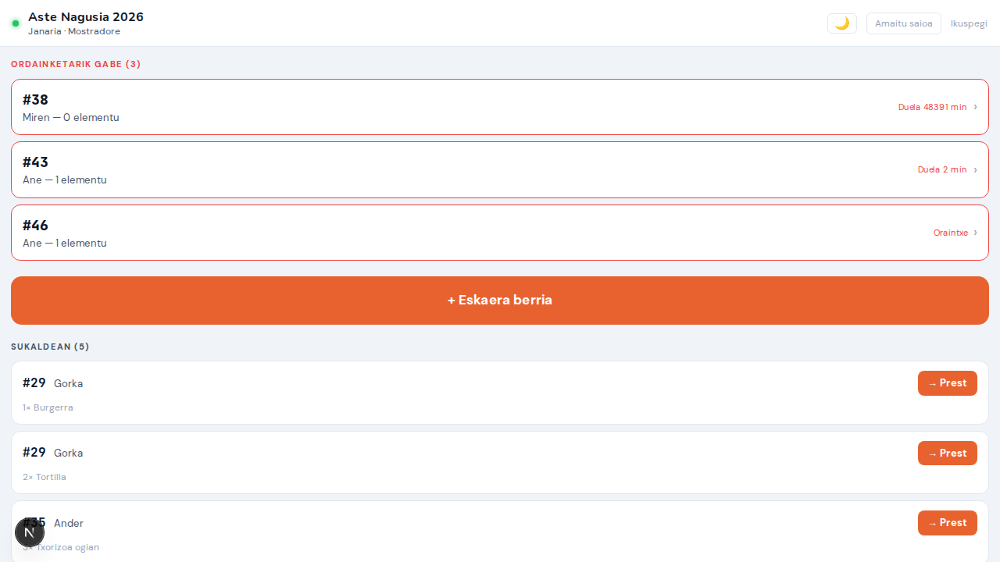
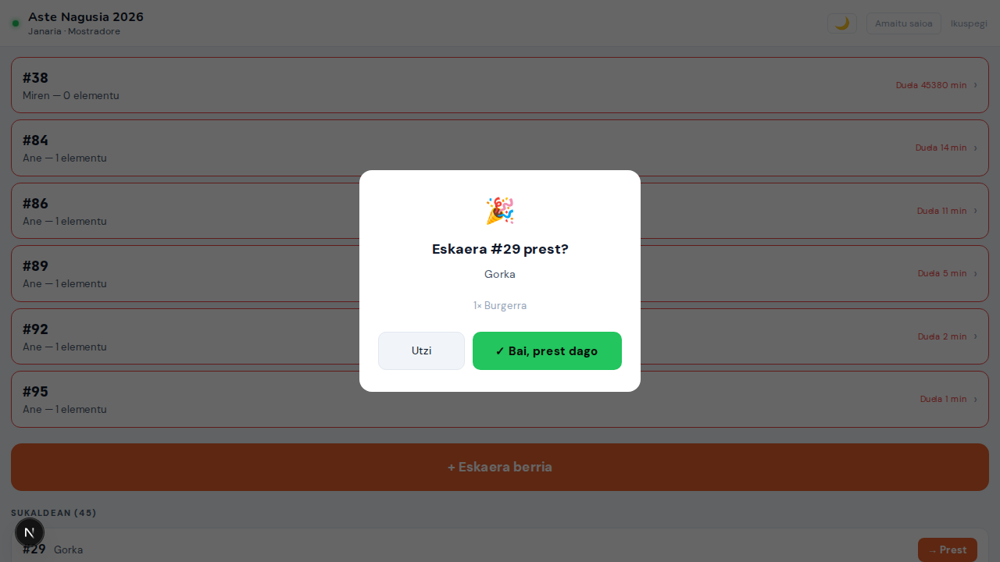
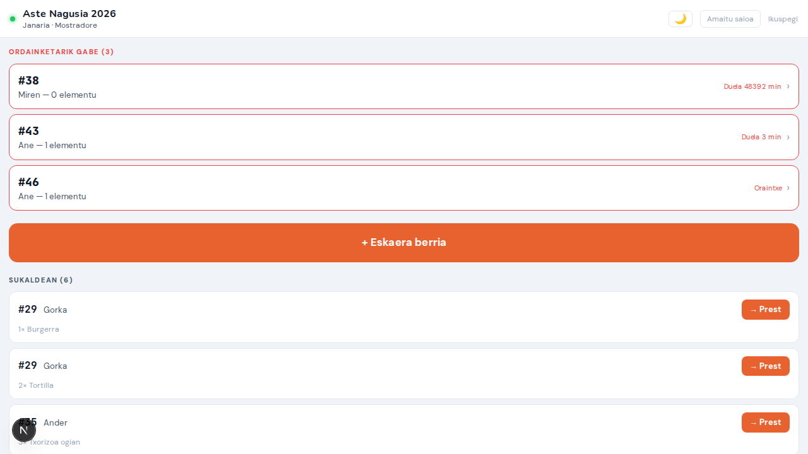
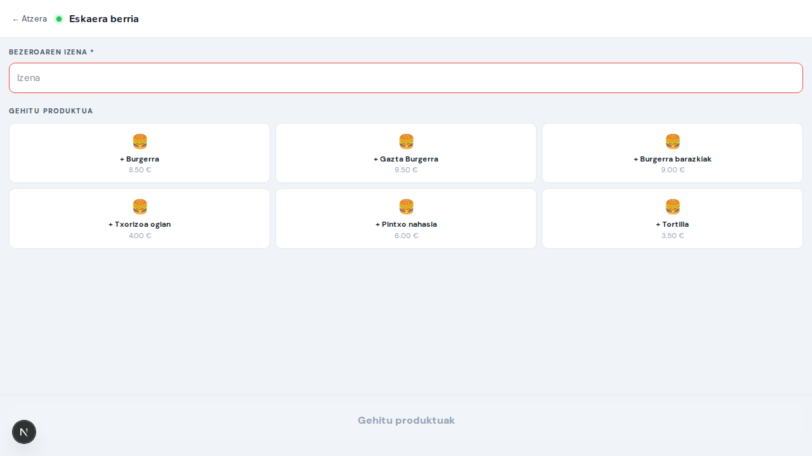
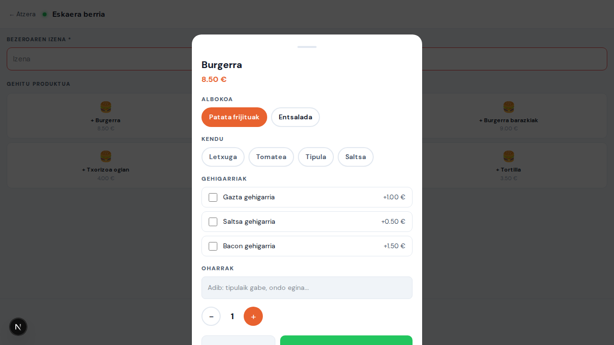
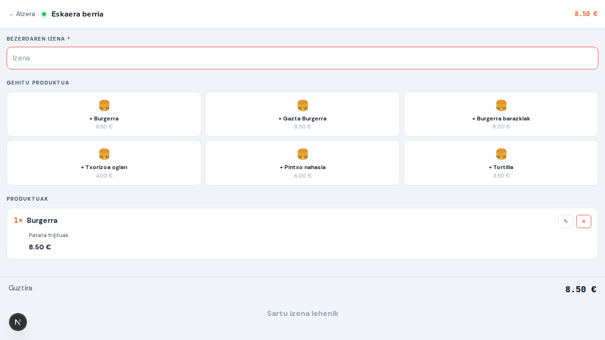

# Txosnabai — Prototipo Berrikuspena

### Interesdunentzako Dokumentua · 2026ko Apirila

---

> **Prototipo honek datu simulatuak erabiltzen ditu** — ez da backend errealik behar.
> Pantaila guztiak nabigatzen dira hemen: `http://localhost:3000/prototype`

---

## Zer da Txosnabai?

Txosnabai txosnak kudeatzeko sistema digital bat da: bezeroen autozerbitzu-eskaerak, sukaldeko lan-fluxua, mostradoreko kudeaketa eta administrazio-txostena biltzen dituen plataforma bakarra.

**Hiru erabiltzaile-mota:**

| Nor                   | Zer egiten du                                                            |
| --------------------- | ------------------------------------------------------------------------ |
| **Bezeroa**           | Menua ikusi, saskia osatu, eskaera bidali, egoera jarraitu               |
| **Boluntarioa**       | Mostradore edo sukaldean lan egin, eskaera kudeatu, ordainketak jasotzea |
| **Administratzailea** | Menua konfiguratu, boluntarioak kudeatu, txostenak ikusi                 |

---

## Pantailen ibilbidea

```
┌──────────────────────────────────────────────────────────┐
│                    BEZEROAREN IBILBIDEA                   │
│                                                           │
│  Menua ──► Produktua hautatu ──► Saskia ──► Checkout     │
│                                              │            │
│                                              ▼            │
│                                        Eskaera Egoera    │
│                                              │            │
│                                              ▼            │
│                                      Jasotzeko Frogagirria│
└──────────────────────────────────────────────────────────┘

┌──────────────────────────────────────────────────────────┐
│                  BOLUNTARIOAREN IBILBIDEA                 │
│                                                           │
│  PIN Sarbidea ──► Janaria Mostradore                      │
│               ├──► Edariak Mostradore                     │
│               ├──► Postu hautaketa ──► Sukaldea (KDS)     │
│               └──► Sukalde Kudeaketa (koordinatzailea)   │
└──────────────────────────────────────────────────────────┘

┌──────────────────────────────────────────────────────────┐
│                 ADMINISTRATZAILEAREN IBILBIDEA            │
│                                                           │
│  Admin Panel ──► Menua / Boluntarioak / Ezarpenak        │
│              ├──► Txostenak                               │
│              └──► TicketBAI Faktura Liburua               │
└──────────────────────────────────────────────────────────┘
```

---

# I. BEZEROAREN PANTAILAK

## 1. Menua

**URL:** `/eu/aste-nagusia-2026`

Bezeroaren lehen kontaktua txosnarekin. Pantaila honek txosna-izena, egoera (**Irekita** berde-argia), zain-denbora estimatua eta produktuen katalogoa erakusten ditu.

**Eginbideak:**

- Goiburuan: txosna-izena · egoera-etiketa · `~8 min` zain-denbora · gau-modu botoia
- Bi kategoria-fitxa: **Janaria** eta **Edariak**
- Produktu-txartelak: argazkia, izena, deskribapena eta prezioа (gorriz)
- Produktu bat ukituz gero, xehetasun-orria irekitzen da (aukera-taldeak, gehigarriak, osagaiak kentzeko aukera)

**Onurak kudeaketarako:**

- Bezeroak menua bere telefonoan ikusi dezake ilaran egon gabe
- Zain-denbora ikustean, bezeroak espektatibak kudeatzen ditu eta ez da etengabe galdetzen
- Produktuak agortzen direnean, KDS-etik "agortu" markatzen da eta bezeroaren menuan desaktibatu egiten da automatikoki

---

## 2. Eskaera Baieztapena (Checkout)

**URL:** `/eu/aste-nagusia-2026/checkout`

Saskiaren laburpena: elementuak berrikusi, izena eman eta eskaera bidali.

**Pantailak erakusten duena:**

- Saskia hutsik badago: "Saskia hutsik dago · ← Menura itzuli" mezu argia
- Saskia beterik: elementuen zerrenda prezio-unitarioekin, guztira eta izen-eremua
- "Eskaera bidali" botoia → eskaera sortzen da eta egoera-pantailara bidaltzen du

**Onurak:**

- Bezeroak bere eskaera berrikusteko aukera du aurretik — erroreak gutxitu
- Izenaren eremu soilak izaera pertsonala ematen dio: "Gorka" deitzea posible da

---

## 3. Eskaera Egoera

**URL:** `/eu/order/order-1`

Eskaerak bidali ondoren, bezeroak pantaila hau bistaratzen du. Egoera aldatzen doan heinean automatikoki eguneratzen da.

**Pantailak erakusten duena:**

- Eskaera-zenbakia handia eta nabarmena: **#42**
- Hiru pausoko progresoa:
  1. ✓ **Jasota** (betea, orangea)
  2. 🧑‍🍳 **Prestatzen** (itxaroten)
  3. 🎉 **Prest!** (itxaroten)
- Proto-oharra: "Egoera automatikoki aldatzen da (2s). Demo bakarrik."
- **Txartel argia / Faktura** atala (TicketBAI gaituta dagoenean): faktura-erreferentzia, data eta QR botoia


> **[ARGAZKI-OHARRA — 41-order-status-fiscal-invoice.png]**
> Hartu argazkia bezeroaren eskaera-egoera pantailari (`/eu/order/[id]`) eskaera CONFIRMED egoerean dagoenean eta TicketBAI faktura bat jada jaulkita dagoenean. Pantailak erakutsi behar du: eskaera-zenbakia eta egoera-progresoa goialdean; eta beheko aldean "Txartel argia / Faktura" sekzioa faktura-erreferentziarekin (adib. TB-2026-00000001), data eta "QR kodea ikusi" botoiarekin (urdin/linea kolorea).

**Onurak:**

- Bezeroak ez du galdetu behar "ea eskaera hartu duten" — pantailak erakusten du
- Zarata-maila mostradoreetan drastikoki murrizten da
- SSE (Server-Sent Events) bidez eguneratzen da denbora errealean — ez da orria freskatu behar
- TicketBAI gaituta dagoenean, bezeroak bere faktura fiskala pantailan bertan du, QR kodearekin Hazienda Vaskarekiko egiaztapenerako

---

## 4. Jasotzeko Frogagirria

**URL:** `/eu/order/order-1/proof`

Eskaera prest dagoenean, bezeroak pantaila hau erakusten du mostradorera hurbildu baino lehen.

**Pantailak erakusten duena:**

- Atzeko planoa berde ilun osoan (distraktore gutxiago)
- Eskaera-zenbakia erraldoia: **#42**
- Egiaztapen-kodea tipografia monoespacioan: **GH-7421**
- "Pantaila pizturik mantentzen da" (WakeLock API)
- ← Egoerara itzuli botoia

**Onurak:**

- Boluntarioak zenbakia eta kodea ikusi besterik ez du egin behar: azkarra eta erroregabea
- Pantaila iltzatuta geratzen da (ez da itzaltzen bilketa-zain dagoen bitartean)
- Kodeak iruzurra saihesten du: edozeinek zenbakia ezagut dezake, baina kodea soilik eskaeraduna dauka

---

## 5. Jendaurreko Taula (Order Board)

**URL:** `/eu/aste-nagusia-2026/board`

Pantaila handietan (telebista, tablet) jartzeko moduko taula publikoa.

**Pantailak erakusten duena:**

- Ezkerraldea — **PREST (3)**: #30 GORKA ✓ · #34 JOSU ✓ · #38 ✓ (berde bizian)
- Eskuinaldea — **PRESTATZEN**: #29, #30, #33, #37 (anbarra) barne-irristaketa biziarekin
- Goiburuan: txosna-egoera + itxaron-denbora estimatua + erreprodukzio-kontrolak

**Onurak:**

- Bezeroak taulatik ikusi dezake bere zenbakia prest dagoen ala ez
- Txosna-arduradunak egoera ikustarazten du itxaronaldian dagoen jendeari
- Kodea sartu gabe funtzionatzen du — edozein pantailaetan jar daiteke

---

## 6. Eskaeraren Jarraipena — Mostradoreko Eskaera Kodearen Bidez

> **Aukerako eginbidea** — Txosna bakoitzeko konfiguraziotik gaitu/desgaitu daiteke ("QR kodea" fitxan).

**URL:** `/eu/[slug]/track`

Mostradorean hartu eskaera baten ondoren, boluntarioak kode laburra ematen dio bezeroari. Bezeroak kode hori erabiliz bere eskaeraren egoera jarraitu dezake bere telefonoan — eta TicketBAI gaituta badago, bere faktura fiskala ere bertatik jaso dezake.

---

### 6a. Boluntarioaren pantaila — Eskualdatze txartela

**URL:** `/eu/counter` (boluntarioaren pantaila)

Boluntarioak mostradore-pantailatik eskaera berri bat sortzen eta baieztatzen duenean, **eskualdatze txartel bat** agertzen da pantaila osoa hartuz:


> **[ARGAZKI-OHARRA — 42-counter-handoff-card.png]**
> Hartu argazkia mostradoreko pantailari eskaera berri bat baieztatzen denean (mobileTrackingEnabled gaituta). Pantaila osoko txartel dark-modu bat agertzen da: "ESKAERA #42" testu txikia goialdean, "Eman kode hau bezeroari" instrukzioa, kode monoespacioa letra handi zuriarekin etxe-beltz atzeko planoan (adib. AB-1234), QR kode handi bat, "Edo geroago idatzi hemen: /aste-nagusia-2026/track" testu txikia, eta "Itxi" botoi laranja bat behean.

**Txartelak erakusten duena:**

- `ESKAERA #42` — eskaera-zenbakia
- **"Eman kode hau bezeroari"** — boluntarioari instrukzioa
- **Kode laburra letra handiz**: adib. `AB-1234` (monoespacioan, letra zuriak etxe-beltze gainean)
- **QR kodea** (160×160 px) — bezeroaren telefonoarekin eskaneatzeko; zuzenean `/eu/[slug]/track/AB-1234` orrialdera doa
- URL testuan: `Edo geroago idatzi hemen: /aste-nagusia-2026/track`
- **"Itxi"** botoi laranja bat — boluntarioak baztertu ostean mostradorea ikusgai geratzen da

**Boluntarioak zer egiten du:**

1. Bezeroak ordaindu du (edo ordainketa hartu da)
2. Pantailan automatikoki txartela agertzen da
3. Boluntarioak QR kodea erakusten dio bezeroari telefonoz eskaneatzeko **edo** kode alfanumerikoa ahozka/papereez ematen dio
4. "Itxi" klikatzen du eta mostradorera itzultzen da

---

### 6b. Kode sarrera orrialdea (bezeroa)

**URL:** `/eu/aste-nagusia-2026/track`

Bezeroak URL-a idazten du edo QR kodea eskaneatzen du. Kodea QR bidez eskaneatuz gero, zuzenean 6c ataleko orrialdera doa (sarrera-orria saltatu egiten da).


**Pantailak erakusten duena:**

- Txosna-izena goiburuan
- Testu-eremua: "Zure kodea" (letra monoespacioan, maiuskulak automatikoki)
- Laguntza-oharra: "Adib.: AB-1234"
- "Bilatu" botoia → hurrengo orrialdera
- Kodea oker badago: mezu argia ("Koderik ez da aurkitu")

**Onurak:**

- Ez da konturik sortu behar — kodea da bezeroaren kredentzial bakarra
- Edozein telefonoz funtzionatzen du, aplikaziorik gabe

---

### 6c. Eskaera egoera orrialdea (bezeroa)

**URL:** `/eu/aste-nagusia-2026/track/AB-1234`

Kode zuzena sartu ondoren (edo QR eskaneatuta), bezeroak denbora errealean ikusten du bere eskaeraren egoera eta faktura fiskala.


> **[ARGAZKI-OHARRA — 43-track-status-with-invoice.png]**
> Hartu argazkia bezeroaren eskaera-jarraipena pantailari (`/eu/[slug]/track/AB-1234`) eskaera CONFIRMED edo prest dagoenean eta faktura jaulkita dagoenean. Erakutsi behar du: goiburua "← Txosna-izena" loturarekin eta "Eskaera #42" izenburuarekin; jarraian egoera-txartelak (Janaria Prest!, Edariak Amaituta); "Txartel argia / Faktura" sekzioa faktura-erreferentziarekin (TB-00000042), data eta "QR kodea ikusi →" esteka; eta azpian "↓ Deskargatu txartela" botoi laranja lerro batean.


**Pantailak erakusten duena:**

- Eskaera-zenbakia eta bezeroaren izena goialdean
- Txartel bat mostradoreko mota bakoitzeko (Janaria / Edariak), egoerarekin:
  - Jasota · Prestatzen · **Prest! 🎉** · Amaituta ✓
- Guztia prest dagoenean: **"Zure eskaera prest dago! Jaso dezakezu."** barra berde bat
- **"Txartel argia / Faktura" atala** (TicketBAI gaituta dagoenean eta faktura jaulkita dagoenean):
  - Faktura-erreferentzia monoespacioan: adib. `TB-00000042`
  - Data: `2026ko api. 30` · `10:00`
  - **"QR kodea ikusi →"** esteka — Hazienda Vaskaren egiaztapen-orrira berri fitxa batean
- **"↓ Deskargatu txartela"** botoia — jasotzeko txartela/frogagirria

**Onurak:**

- SSE bidez eguneratzen da denbora errealean — ez da orria freskatu behar
- Bezeroak faktura fiskala hemen bertan du: ez da beste URL-rik behar
- Telefono bidez edo QR eskaneatuz eskura daiteke — mostradorean beti erosoa

---

### 6d. Txartela inprimatzeko

**URL:** `/eu/aste-nagusia-2026/track/AB-1234/receipt`

Inprimatzeko moduko HTML orrialde gisa ematen da, PDFa sortu gabe.


**Txartelak biltzen duena:**

- Txosna-izena eta data
- Eskaera-zenbakia eta bezeroaren izena
- Produktuen zerrenda aldaera eta gehigarriekin eta prezioekin
- Guztira
- **"Txartel argia / Faktura" sekzioa** (TicketBAI gaituta eta faktura jaulkita dagoenean):
  - Faktura-erreferentzia
  - QR URL testuan (inprimatzean eskaneatzeko)
- "Ez da zerga-dokumentua" ohar soilarekin (TicketBAI **ez** dagoenean soilik)

**Onurak:**

- Bezeroak bere telefonoko PDF gisa gorde dezake
- Ez da liburutegirik behar zerbitzarian — nabigatzaileak inprimatzen du

---

# II. BOLUNTARIOAREN PANTAILAK

## 7. PIN Sarbidea

**URL:** `/eu/pin`

Edozein boluntariok sartzen den lehen pantaila. Autentifikazio sinplea PIN zenbakiarekin.


**Pantailak erakusten duena:**

- Txosna-izena goiburuan: **Aste Nagusia 2026**
- Lau modu-botoi:
  - 🍽 **Janaria** (orangeaz nabarmenduta)
  - 🍺 **Edariak**
  - 👨‍🍳 **Sukaldea**
  - 📋 **Kudeaketa**
- 4 digituko PIN-teklatu
- Behean: "Sartu — [modua]" botoia

**Sukaldeko postu hautaketa:**

Sukaldea modua hautatu eta PIN zuzena sartu ondoren, txosnak postuak konfiguratuta baditu, postu-hautaketa pantaila agertzen da:


PIN onarpena eta gero:


- Postu bakoitzeko botoi bat (adib. **plantxa**, **muntaia**) — boluntarioa bere postuko tiketak bakarrik ikusten ditu KDS-ean
- **Postu guztiak (Kudeaketa)** — koordinatzaileak ikuspegi orokorra ikusten du

**Sukaldeko postu hautaketa:**

PIN onartzen denean eta **Sukaldea** modua hautatuta dagoenean, txosnak postuak konfiguratuta baditu (adib. "Parrilla" eta "Muntaia"), postu-hautaketa pantaila agertzen da:

- Postu bakoitzeko botoi bat — boluntarioa bere lan-postuan jartzen da eta postu horretako tiketak bakarrik ikusten ditu KDS-ean
- **Kudeaketa (guztiak)** aukera — koordinatzaileak postu guztien ikuspegi orokorra ikusten du

**Onurak:**

- Boluntarioak ez du pasahitz konpliaturik gogoratu behar
- Modu-hautaketak boluntarioa zuzenean dagokion pantailara bidaltzen du
- PIN bakarra txosna guztiarentzat: erraztasun operatiboa
- Postu hautaketak sukaldeko lan-fluxua banatzen du: parrillako boluntarioak bere tiketak bakarrik ikusten ditu, nahastasunik gabe

---

## 8. Janaria Mostradore

**URL:** `/eu/counter`

Janari-mostradoreko kudeaketa-pantaila nagusia.

### 7a. Ikuspegi orokorra



**Pantailak erakusten duena:**

- Goiburua: **Aste Nagusia 2026 · Janaria · Mostradore** + Gelditu / Ikuspegi botoiak
- **ORDAINKETARIK GABE** atala (gorria): telefono edo autozerbitzu bidezko eskaera ordaindu gabeak, denbora-markarekin
- **+ Eskaera berria** botoi nagusi orangea — mostradorean bertan hartu eskaera
- **SUKALDEAN** atala: sukaldean prestatzen ari diren eskaera guztiak, `→ Prest` botoi batekin bakoitza
- **PREST JASOTZEKO** atala (berdea): jasotzeko zain dauden eskaera amaituta daudenak, `✓ Jasota` botoi batekin

**Onurak:**

- Ordainketarik gabeko eskaera guztiak ikusten dira goialdean, denbora-marka barne — boluntarioak presaka dauden kasuak berehala identifikatzen ditu
- Hiru sekzioek eskaera-egoera argi bereizten dute: zein ordaindu, zein sukaldean, zein biltzeko prest

**Jarraipen mugikorra gaituta dagoenean (aukerako):**

- Eskaera baieztatzen denean, "kode trukaketa txartela" agertzen da pantailatik: eskaera-zenbakia, kode laburra (adib. AB-1234), QR kodea eta jarraipen-URLa
- Boluntarioak QR kodea erakusten dio bezeroari (edo kodea ahozka) eta "Itxi" klikatzen du prest dagoenean
- Pantailaren behean "Bukatutako eskaerak" panel bat dago (tolestuta), azken 20 bukatutako eskaerekin kode eta QR txiki bana dituena — bezeroak geroago txartela eskatzera badator, boluntarioak kode horretatik birbidali dezake

---

### 8b. Ordainketa jasotzea (ORDAINKETARIK GABE)


Ordaindu gabeko eskaera baten gainean klik eginda, ordainketa-elkarrizketa irekitzen da:

- Eskaera-zenbakia eta bezero-izena goialdean
- Produktu-zerrenda prezio-unitarioekin eta **Guztira** batura
- **ORDAINDUTAKOA (TRUKERAKO)** eremu bat: boluntarioak bezerotik jasotako kopurua sartzen du
- Trukea automatikoki kalkulatzen da
- **✓ Ordaindu · Sukaldera bidali** botoiak ordainketа erregistratzen du eta eskaera sukaldera bidaltzen du

**Onurak:**

- Trukearen kalkulu automatikoak akatsak saihesten ditu
- Botoi bakar batek ordainketa erregistratzen du eta sukaldera bidaltzen — urrats gutxiago

---

### 8c. Eskaera prest markatzea (SUKALDEAN → PREST)



Sukaldeko boluntarioak eskaera prest utzi ondoren, mostradoreko boluntarioak `→ Prest` klikatu eta baieztapen-elkarrizketa agertzen da:

- Eskaera-zenbakia eta bezero-izena
- Produktu-zerrenda
- **✓ Bai, prest dago** botoiak eskaera PREST JASOTZEKO atalera mugitzen du eta bezeroaren telefonora jakinarazpena bidaltzen da
- **Utzi** botoiak elkarrizketa ixten du aldaketarik gabe

**Onurak:**

- Baieztapen-pausoak nahi gabeko "prest" klikak saihesten ditu
- Bezeroak telefonoan jakinarazpena jasotzen du berehala — ez da oihukatu behar

---

### 8d. Eskaera jasota markatzea (PREST JASOTZEKO → AMAITUTA)



Bezeroa mostradorera heltzean, `✓ Jasota` klikatu eta eskaera ixten da:

- Sekzio berdeak eskaera prest daudela adierazten du
- `✓ Jasota` bakoitzak eskaera zuzenean AMAITUTA egoerara pasatzen du
- Pantailatik desagertzen da eta taulatik ere kentzen da

---

### 8e. Eskaera berria sortzea



`+ Eskaera berria` botoiak pantaila berri bat irekitzen du:

- **Bezeroaren izena** eremu derrigorrezkoa (gorriz nabarmendu izenarik gabe)
- **GEHITU PRODUKTUA** produktu-sareta: produktu bakoitzeko botoi bat izenarekin eta prezioarekin
- Produktu bat ukituz gero, produktu-konfigurazio orria irekitzen da

---

### 7f. Produktu-konfigurazioa



Produktu bat hautatzen denean, konfigurazio-orri bat irekitzen da:

- **Produktu-izena** eta **oinarrizko prezioa**
- **ALBOKOA** (aukera-taldea): Patata frijituak / Entsalada — aukera bat hautatu behar
- **KENDU** osagaiak: Letxuga, Tomatea, Tipula, Saltsa — boluntarioak bezeroaren eskakizunak ezabatu ditzake
- **GEHIGARRIAK** (prezio gehigarriarekin): Gazta gehigarria, Saltsa gehigarria, Bacon gehigarria — checkboxekin
- **OHARRAK** eremu librea: edozein ohar berezi
- **Kantitatea** kontrola: − / + botoiak
- **Gehitu — XX.XX €** botoiak produktua saskira gehitzen du, prezio eguneratuta

**Onurak:**

- Aukera guztiak pantaila bakarrean: ohiak, gehigarriak, osagaiak kentzeko — erroreak gutxiago
- Prezio eguneratua denbora errealean erakusten da, ordaintzeko prest

---

### 7g. Eskaera saskia eta bidaltzea



Produktua gehituta eta izena sartu ondoren:

- **PRODUKTUAK** atalean elementu bakoitza: kantitatea, izena, aukera hautatua eta prezioa
- Editatu (✏️) eta kendu (✕) botoiak lerro bakoitzean
- **Guztira** batura behean
- **✓ Sortu eta bidali sukaldera — XX.XX €** botoi berdea: eskaera sortzen da, CASH ordaindu gabe eta sukaldera bidaltzen da
- Botoia gris dagoela "Gehitu produktuak" edo "Sartu izena lehenik" mezuak izenaren edo produkturik eza adierazten du

**Onurak:**

- Eskaeraren laburpena ikustean, boluntarioak akatsak konpondu ditzake bidaltzea baino lehen
- Botoi bakarreko bidalketa: eskaera sortu eta sukaldera bidali aldi berean

---

## 9. Edariak Mostradore

**URL:** `/eu/drinks`

Edariak mostradorearen pantaila: zerrendako eskaerak eta eskaera berrien sortzailea.

**Pantailak erakusten duena:**

- Goiburua: **Edariak · Mostradore**
- **ZAIN (2)** atala:
  - #41 Josu (duela 4 min) — 2× Garagardoa + 1× Ura = **6.00 €** · `✓ Entregatu` (berdea)
  - #38 (duela 9 min) — 3× Ardoa = **9.00 €** · `✓ Entregatu`
- **+ Eskaera berria** botoi handia behean

**Onurak:**

- Edariak mostradoreak bere ilara propioa du, janariaren ilararengandik independentea
- `✓ Entregatu` botoiak eskaera zuzenean ixten du — sukaldera joan gabe
- Prezio totala modu nabarmenean bistaratzen da: ordainketa azkarragoa

---

## 10. Sukaldea — KDS (Kitchen Display System)

**URL:** `/eu/kitchen`

Sukaldeko pantaila nagusia. Hiru zutabe dauzka egoeraren arabera. Txosnak sukaldeko postuak konfiguratuta baditu eta boluntarioak postu bat hautatu badu PIN sarbidean, KDS-ak postu horretako tiketak bakarrik erakusten ditu — goiburuan ageri da zein postutan dagoen (adib. **Aste Nagusia 2026 · parrilla**).

**Postu bidezko iragazkia:**

Txosnak sukaldeko postuak konfiguratuta dituenean (adib. _plantxa_, _muntaia_), KDS-ak boluntario bakoitzak PIN sarreran hautatutako postuaren tiketak bakarrik erakusten ditu. Goiburuak beti erakusten du zein postutan zauden:


**Pantailak erakusten duena:**

- Goiburua: **Aste Nagusia 2026 · plantxa** + gau-modua + 📦 notifikazio-txipa + **+ Eskaera** botoia
- Hiru fitxa: **2 Jasota** · **2 Prestatzen** · **2 Prest**
- Lehen txartela — #38 Miren:
  - `JASOTA` etiketa urdina
  - 2× Txorizoa ogian · 1× Tortilla — _2tan banatu_
  - `→ Hasi` botoi orangea + liburua ikurra (prestatze-argibideak)
- Bigarren txartela — #41 Josu:
  - 2× Burgerra — ❌ Tipula · ❌ Saltsa (osagaiak kentzeko aginduak argi ikusten dira)
  - 1× Entsalada — _alkate-saltsa barik_
  - 3× Pintxo nahasia
  - 📝 "Burgerra ondo eginda mesedez" oharra (anbarra atzeko planoaz)
  - `→ Hasi` botoia

**Onurak:**

- Sukaldeko boluntarioak begirada bakarrean ikusten du zer prestatu behar duen _bere postu espezifikoan_
- Osagaiak kentzeko aginduak modu ikusgarrian bistaratzen dira (❌ ikurra): errore gutxiago
- Bezeroen oharrak anbarra kolorez markatzen dira: ezin da galdu
- `→ Hasi` ukitze bakarrarekin eskaera "Prestatzen" kolumnara mugitzen da eta bezeroari jakinarazten zaio
- Postu-iragazkiak nahasmena ekiditen du: parrillakoek bere tiketak bakarrik ikusten dituzte

---

## 11. Sukalde Kudeaketa (Kitchen Manager)

**URL:** `/eu/kitchen-manager`

Koordinatzailearen pantaila: sukaldeko eskaera guztiak ikuspegi bakarrean, postu guztietakoak barne. PIN sarreran **Postu guztiak (Kudeaketa)** hautatuz edo **📋 Kudeaketa** modu zuzena erabiliz iristen da.


**Pantailak erakusten duena:**

- Goiburua: **Aste Nagusia 2026 · Kudeaketa** + estatistika-txipak:
  - 🍳 **Sukaldean:** eskaera kopurua prestatzen
  - ✅ **Jasotzeko:** prest dauden eskaera kopurua
  - 📦 **Stock** botoia (stock-kudeaketa panel bat irekitzen du)
- Eskaera-txartelak ordena honetan: prest daudenak lehenik (bilketa eskaeraren zain), gero zaharrenak aurrera
- Txartel bakoitzak erakusten du:
  - **Eskaera-zenbakia** eta bezero-izena
  - **Progres-barra**: postu-tiketen zein ehuneko dauden prest
  - **Postu-errenkadak**: postu bakoitzeko (adib. _plantxa_, _muntaia_) egoera bereizi bat — _Jasota_, _Prestatzen_, _Prest ✓_
  - Eskaera guztiz prest dagoenean, txartela berdez nabarmenduta agertzen da: **PREST ✓**
- Denbora errealean eguneratzen da SSE bidez

**Onurak:**

- Koordinatzaileak une bakoitzean eskaera bakoitzaren egoera guztia ikusten du — bi postutan banatuta dagoen eskaera ere bai
- "Prest" txartelak goialdean agertzen dira: bilketa-deiak azkarrago egiten dira
- Postu-iragazkirik gabe: ikuspegi osoa, ez bakarrik postu batekoa
- Stock-botoia eskura: produktua agortzen denean berehala desgaitu daiteke boluntarioen menutatik
- Irakurtzeko bakarrik: sukaldekoek egoera aldatzen dute beren KDS-tik

---

## 12. Egoera Ikuspegi (Overview)

**URL:** `/eu/overview`

Txosna osoaren egoera-laburpena denbora errealean. Zuzendariarentzat edo boluntario nagusiarentzat.

**Pantailak erakusten duena:**

- **ORAIN BERTAN** lau txipa:
  - ITXAROTEN · **1** eskaera
  - PRESTATZEN · **3** eskaera
  - PREST · **1** jasotzeko
  - MOTEL · **1** eskaera (gorria — atentzioa behar)
- **TXOSNA EGOERA** blokea:
  - Egoera: **IREKITA**
  - Itxaron denbora: **~8 min**
  - Boluntarioak aktibo: **3 / 4**
- **MOSTRADOREAK** zerrenda: Janari Mostradore → · Edari Mostradore → · Sukaldea (KDS) →

**Onurak:**

- Txosna-arduradunak segundotan ikusten du egoera orokorra
- "Motel" zenbagailuak isil-isileko arazo bat agerian uzten du (eskaera geldituta)
- Boluntarioak aktibo / guztira: hutsuneak antzemateko eta laguntza eskatzeko

---

# III. ADMINISTRATZAILEAREN PANTAILAK

## 13. Admin Panel — Nabigazio-alboko barra

Pantaila guztietan agertzen da ezkerrean (mahai gainekoan) edo menu gisa (mugikorrean).

**Erakusten duena:**

- **Txosna Admin** goiburua · Elkartea izena
- ELKARTEA atala: Menua · Txosnak · Boluntarioak · **TicketBAI** · Ezarpenak
- TXOSNAK atala: Aste Nagusia 2026 (berdea) · Pintxo Txokoa (berdea) · Garagardo Barra (anbarra)
- \+ Txosna berria botoia
- Behean: Ilun modua · ← Mostradorera itzuli

**Onurak:**

- Elkarte batek hainbat txosna kudeatu ditzake interfaze bakarretik
- Txosna-kolorea (berdea/anbarra/gorria) egoera azkar irakurtzeko

---

## 14. Menu Kudeaketa

**URL:** `/eu/menu`

Produktu-katalogoa sortu, editatu eta antolatzeko pantaila.

**Pantailak erakusten duena:**

- Kategoria-botoiak: **Janaria (6)** (orangeaz) · **Edariak (6)**
- Produktu-txartelak: irudia, izena, prezioa, aukera-taldeen kopurua, gehigarrien kopurua eta alergenoen ikonoak
- Produktu bakoitzak ✏️ editatu botoia

**Produktu-editoreak barne hartzen ditu:**

- Oinarrizko datuak (izena, prezioa, deskribapena, argazkia)
- **Sukaldeko postua** (txosnak postuak konfiguratuta baditu): produktua postu jakin bati esleitzeko hautatzailea
- Aukera-taldeak (adib. Patata frijituak / Entsalada) — aukera bakoitzak ere badu bere sukaldeko postua
- Gehigarriak (prezio gehigarriarekin) — gehigarri bakoitzak ere badu bere sukaldeko postua
- Osagaiak kentzeko aukera (prezio-aldaketarik gabe)
- 14 EU alergenoak (ikur eta etiketarekin)
- Dietako banderak: V · VG · GF · HL
- Prestatze-argibideak (markdown formatuan)
- Zatitu arauak (gehienez N zatitan)

**Produktuaren sukaldeko postua ezartzea:**


Txosnak sukaldeko postuak konfiguratuta dituenean, produktu-editorean "Sukaldeko postua" hautatzaile bat agertzen da. Produktu bat postu jakin bati esleitzen zaionean, produktu horren tiketak beti postu horretara joaten dira.

**Aukera-taldeen per-aukera sukaldeko postua:**


Aukera-taldeko aukera bakoitzak bere sukaldeko postua dauka. Honek aukera ematen du produktu bat orokorrean postu bati esleitzea, baina aukera berezi bat beste postu batera bidaltzea (adib. _plantxa_ postuko burgerra baina _freibidea_ postu batera bidaltzeko "patata frijituak" aukera).

**Postu-esleipen logika:**

Eskaera bat sortzen denean, sistemak janari-lerro bakoitzeko sukaldeko postuak biltzen ditu:

- Produktuaren postua
- Hautatutako aukeraren postua
- Hautatutako gehigarrien postuak

Lerro batek postu bat baino gehiago ukitzen badu, lerroaren kopia bat bidaltzen da postu bakoitzeko tiketan. Posturik gabeko lerroak tiketa orokor baten bidaltzen dira.

**Onurak:**

- Menua aldatzen duten aldioro boluntarioak ez du paperik eguneratu behar
- Alergenoen informazioa beti eguneratuta eta ikusteko errazean
- Prestatze-argibideak KDS-ean agertzen dira: sukaldekoak beti jakin dezake nola egin
- Postu per-aukera ezartzeak zehazki kontrolatzen du zein postura joaten den eskaeraren zein zati

---

## 15. Boluntarioak

**URL:** `/eu/volunteers`

Boluntario-erregistroa eta rolen kudeaketa.

**Pantailak erakusten duena:**

- Goiburua: **Boluntarioak · Aste Nagusia 2026 · 3 aktibo / 4 guztira**
- AKTIBO: **3** (berdez) · beste bat inaktibo (urdinez)
- Zerrenda: Amaia Etxeberria · Gorka Zubia · Itziar Larrea · Beñat Aranburu
- Bakoitzak email zutabea eta rol/egoera zutabea

**Onurak:**

- Txosna-arduradunak une bakoitzean nor dagoen aktibo ikusten du
- Rolen kudeaketa: ADMIN rolak konfigurazio-pantailetarako sarbidea du; VOLUNTEER rolak ez
- Boluntario berriak gehitzea: formulario sinple bat email + izenekin

---

## 16. Txosna Konfigurazioa

**URL:** `/eu/txosna`

Txosna bakoitzaren parametroak ezartzeko pantaila. Bost fitxa ditu.

**Orokorra fitxa:**

- Egoera hautatzailea: **Irekita** · Geldituta · Itxita
- Itxaron denbora (minutuak): **8**
- Boluntario PIN: **1 2 3 4**
- Gorde botoia

**Sukaldea fitxa (berria):**


- Sukaldeko postuak zerrendan: adib. **plantxa** · **muntaia** (bakoitza ✏️ aldatu / ✕ ezabatu botoiekin)
- "Postu berria" testu-eremua eta **Gehitu** botoia
- Oharra: "Postuak hutsik → tiketa bakar bat; postuak gehituta → boluntarioak bere postua hautatzen du PIN sarreran"
- **Gorde** botoia

Postuak hutsik utziz gero, sukaldea estazio bakarrekoa da (tiketa bakarra eskaera guztientzat). Postuak gehituz gero, PIN sarreran postu-hautaketa pantaila agertzen da boluntarioei eta eskaeren janari-lerroak postu egokiei bideratzen zaizkie automatikoki.

**Gainerako fitxak:**

- **Ordainketa**: eskudirua (beti) · txartela (toggle) + hornitzailea (Stripe / Redsys)
- **Eskariak**: mostradore mota (BATERATU / BEREIZITA), kanalak, elementu-muga, inprimagailua (ESC/POS edo STAR)
- **QR**: kode sortzailea jendaurreko taularentzat

**Onurak:**

- Txosna geldi daiteke une batez (Geldituta egoera) eta bezeroen menuan automatikoki islatzen da
- Ordainketa-metodoak malguki aktibatu/desaktibatu daitezke
- QR kodea jarri testu-mezu edo sare sozialetan eta bezeroak zuzenean menura irits daitezke
- Sukaldeko postuak konfiguratzeak sukaldeko lan-banaketa eta koordinazioa ahalbidetzen du: parrilla, muntaia, freidora…
- Postu bakoitza produktuaren eta aukeraren mailan esleitzen da menu-editoretik

---

## 17. Ezarpenak — BEZ eta TicketBAI

**URL:** `/eu/settings` → **BEZ** fitxa

Elkarteko zerga-ezarpenak kudeatzeko fitxa. Bi zati ditu: TicketBAI konfigurazioa eta BEZ mota-kudeaketa.

### TicketBAI desgaituta (lehenetsia)


> **[ARGAZKI-OHARRA — 38-settings-bez-tab.png]**
> Hartu argazkia admin ezarpenen BEZ fitxari (`/eu/settings`, BEZ fitxa hautatuta) TicketBAI toggle DESAKTIBATUTA dagoelarik. Pantailak erakutsi behar du: goialdean "TicketBAI gaitu" toggle botoia (gris/desaktibatuta egoerean), eta azpian BEZ mota-zerrenda (BEZ Orokorra 21%, BEZ Murriztua 10%, BEZ Superurriztua 4%, BEZtik salbuetsia 0%) eta "BEZ mota berria gehitu" formularioa.

**Pantailak erakusten duena (toggle off):**

- **"TicketBAI gaitu"** toggle botoia (gris/desaktibatuta)
- **BEZ motak zerrenda**: BEZ Orokorra 21% · BEZ Murriztua 10% · BEZ Superurriztua 4% · BEZtik salbuetsia 0%
- Bakoitza ✏️ aldatu / 🗑 ezabatu botoiekin
- **BEZ mota berria gehitu** formularioa: label + ehuneko + Gehitu botoia

### TicketBAI gaituta


> **[ARGAZKI-OHARRA — 39-settings-bez-ticketbai-enabled.png]**
> Hartu argazkia admin ezarpenen BEZ fitxari (`/eu/settings`, BEZ fitxa) TicketBAI toggle AKTIBATUTA dagoelarik. Erakutsi behar du: toggle botoia urdin/aktibo kolorean, eta azpian konfigurazio-panela zabalik: "Faktura seriea" eremu bat "TB" balioarekin, "Hornitzailea" dropdown bat "Mock (Probak)" hautatuta, "Konexioa probatu" botoi bat eta "Gorde konfigurazioa" botoi gorri-laranja bat. Ondoren lotura bat: "→ Faktura liburua ikusi".

**Pantailak erakusten duena (toggle on):**

- **"TicketBAI gaitu"** toggle botoia (urdina/aktibo)
- **Konfigurazio-panela**:
  - **Faktura seriea** eremu bat: "TB" balio lehenetsiarekin — faktura-zenbakien aurrizkia (adib. `TB-2026-00000001`)
  - **Hornitzailea**: "Mock (Probak)" — etorkizunean hornitzaile errealak gehituko dira (Argi, etc.)
  - **"Konexioa probatu"** botoia — API konexioa egiaztatzen du, "✓ Konexioa ondo" mezu berde batekin
  - **"Gorde konfigurazioa"** botoia
  - **"→ Faktura liburua ikusi"** esteka — faktura-zerrendara zuzenean joaten da
- **BEZ motak zerrenda** (azpian, aldaketarik gabe)

**Onurak:**

- Toggle bakar batek TicketBAI aktibatu eta desaktibatzen du eskaera guztientzat
- Seriea pertsonalizatzeak elkarte bakoitzak bere faktura-identifikadorea izatea ahalbidetzen du
- Konexio-probak konfigurazio-akatsak aurkitzen ditu faktura errealak sortu baino lehen

---

## 18. TicketBAI Faktura Liburua

**URL:** `/eu/ticketbai`


> **[ARGAZKI-OHARRA — 40-ticketbai-invoice-ledger.png]**
> Hartu argazkia admin TicketBAI faktura-liburu pantailari (`/eu/ticketbai`). Pantailak erakutsi behar du: "TicketBAI Fakturak" izenburua goialdean eta "← Ezarpenak" itzultze-esteka. Taula bat jarraian zutabe hauek dituena: "Faktura zenbakia" (adib. TB-00000001), "Eskaera" (#1), "Data" (data formatuarekin), "Guztira" (7.00 €), "Egoera" (MOCK etiketa gris batekin) eta "QR" (esteka botoi txiki bat). Gutxienez bi lerro erakutsi taula beterik dagoela ikusteko.

**Pantailak erakusten duena:**

- **"TicketBAI Fakturak"** izenburua + **"← Ezarpenak"** itzultze-esteka
- **Faktura-taula** zutabe hauek dituena:
  - **Faktura zenbakia**: `TB-00000001` formatuan (serie + zenbaki beteta 8 digitura)
  - **Eskaera**: `#1` (eskaera-zenbakia)
  - **Data**: `30 api. 2026` formatuan
  - **Guztira**: `7.00 €`
  - **Egoera**: koloretako etiketa bat — MOCK (grisa) · SUBMITTED (urdina) · ACCEPTED (berdea) · REJECTED (gorria)
  - **QR**: esteka-botoi txiki bat Hazienda Vaskako egiaztapen-orrira
- **Hutsik dagoenean**: "Oraindik ez da fakturik jaulki" mezu informatibo bat

**Zergatik da garrantzitsua?**

TicketBAI araudi fiskalak exijitzen du faktura guztien erregistro iraunkor bat mantentzea, API hornitzaile baten eskutik independenteki. Faktura liburuak bermatzen du:

- **Ikusgarritasuna**: Administradoreak une oro ikus ditzake jaulkitako faktura guztiak
- **Auditoria**: Inspektoreak faktura-katea egiaztatu dezake: bakoitza aurreko fakturari lotuta dago SHA-256 hash bidez
- **Hornitzailearekiko independentzia**: Fakturak sisteman gordetzen dira API hornitzailea aldatzen bada ere

---

## 19. Txostenak

**URL:** `/eu/reports`

Salmenten eta eragiketen laburpena.

**Pantailak erakusten duena:**

- Izenburua: **Txostena · Aste Nagusia 2026 · Gertaera amaierako laburpena**
- Iragazki-botoiak: **Gaur** · Astebete · Guztira
- **ESKARIAK** txipa: **2** (2 baieztatuta)
- **Produktu salduenen** zerrenda:
  1. Burgerra — 5 saldu · 43 €
  2. Gazta Burgerra — 3 saldu · 29 €

**Onurak:**

- Gertaera amaieran, txosna-arduradunak salmenta-laburpena segundotan du eskura
- Produktu-popularitatea: datorren gertaerarako stock hobeto planifikatzeko
- Denbora-iragazkiak: eguneko eta asteko ikuspegia, ez bakarrik guztira

---

# IV. ONURA NAGUSIAK LABURBILDUTA

## Bezeroaren esperientzia

| Arazo ohikoa                                | Soluzio berria                                |
| ------------------------------------------- | --------------------------------------------- |
| "Ea eskaera hartu duten galdetzen jarraitu" | Egoera-pantaila denbora errealean telefonoan  |
| Ilara luzeetan zain itsurik                 | Zain-denbora estimatua menuan bertan          |
| "Nire zenbakia zein da?" galdera            | Pantaila handian #zenbakia berde bizian       |
| Ordaintzean korapiloak                      | Frogagirria pantailan, egiaztapen-kodea barne |

## Boluntarioen eraginkortasuna

| Arazo ohikoa                | Soluzio berria                                                                     |
| --------------------------- | ---------------------------------------------------------------------------------- |
| Txartelak paperean galdu    | KDS digitalean eskaera guztiak ikusgai                                             |
| "Osagaiak kentzeko" ahaztu  | KDS-ean ❌ ikurrez nabarmendu                                                      |
| Ordainketa-trukea kalkulatu | Mostradoreak trukea automatikoki kalkulatzen du                                    |
| Edariak eta janaria nahastu | Mostradore bereiziak, ilara independenteekin                                       |
| Sukaldea non dagoen eskaera | `→ Hasi` ukitu bakarrarekin egoera aldatu                                          |
| Sukaldeko postuak nahastu   | Postu hautaketak boluntarioa bere postura bideratzen du — beste postuak ikusezinak |

## Kudeaketaren ikusgarritasuna

| Arazo ohikoa                                | Soluzio berria                                                             |
| ------------------------------------------- | -------------------------------------------------------------------------- |
| "Ez dakit zenbat saldu dugun"               | Txostenak denbora errealean                                                |
| Boluntarioak non dauden jakin ez            | Overview-k aktibo/guztira erakusten du                                     |
| Menu aldaketak paper/pizarrabean            | Admin panelean editatu → berehala eguneratuta                              |
| Alergenoen informazioa eguneratuta mantendu | Menu-editorean 14 EU alergenoak, betidanik ikusgai                         |
| Postu guztien egoera aldi berean ikusi ezin | Sukalde Kudeaketa pantailak postu guztiak agertzen ditu eskaera bakoitzean |

## Betetze Fiskala (TicketBAI)

| Arazo ohikoa                             | Soluzio berria                                                                     |
| ---------------------------------------- | ---------------------------------------------------------------------------------- |
| Faktura fiskalen erregistroa eskuz       | Sistema automatikoki jaulkitzen du faktura eskaera baieztatzen den unean           |
| Hornitzaile aldatzean fakturak galtzea   | Faktura liburuak faktura guztiak gordetzen ditu, hornitzaileak independenteki      |
| "Nola jakin bezeroak faktura zuzena da?" | QR kodea Hazienda Vaskaren egiaztapen-orrira zuzentzen da zuzenean                 |
| Faktura-katea frogatzea auditoria batean | SHA-256 hash katea: faktura bakoitza aurreko fakturari kriptografikoki lotuta dago |
| Bezeroak faktura eskatu eta bilatu egin  | Eskaera-egoera pantailan automatikoki agertzen da faktura eta QR botoia            |

---

## Hurrengo Pausoak

1. **Backend integrazioa** — Prisma/PostgreSQL bidez datu errealak ✓ (eginda)
2. **SSE konexioa** — eskaera-eguneraketak denbora errealean ✓ (eginda)
3. **Ordainketa** — Stripe edo Redsys konfiguratu ✓ (eginda)
4. **TicketBAI** — Mock hornitzailea ✓ (eginda); hornitzaile errealak (Argi, etab.) gehitzeko prest
5. **Inprimagailua** — ESC/POS edo STAR protokoloa

---

_Dokumentu hau prototipo-pantailetatik sortua da — 2026ko apirileko egoera islatzen du._
